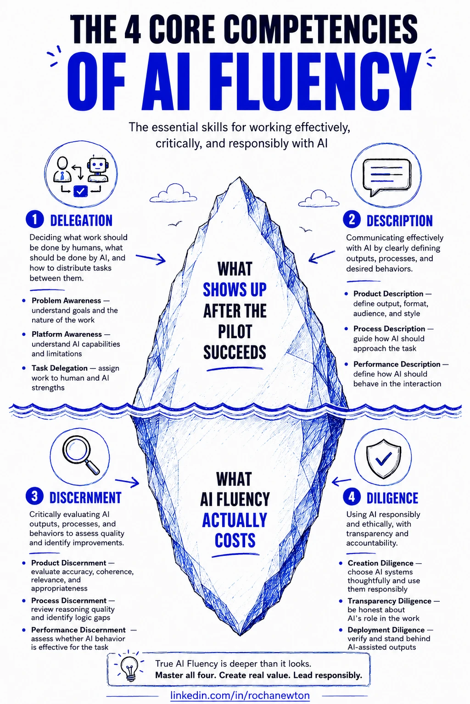

## Prompt é a menor parte disso

A maior parte dos conselhos sobre "ficar melhor em IA" é, na prática, só mais uma coleção de truques de prompt — uma frase melhor, um system prompt mágico, um template que alguém jura que funciona. Nada disso está exatamente errado, mas trata a camada errada como se fosse a parte difícil. A habilidade de verdade não é escrever um prompt esperto. É decidir o que delegar antes de mais nada, dizer com clareza o que você precisa, julgar honestamente se o que voltou é bom, e ser transparente sobre o seu próprio papel depois de usar isso.

O curso **AI Fluency: Framework & Foundations**, da Anthropic — um dos três que compõem o currículo do Claude Certified Associate – Foundations — nomeia essas quatro coisas diretamente: **Delegação, Descrição, Discernimento, Diligência**. Os 4Ds. Entrei esperando um curso de prompting e saí com um framework de decisão, o que é um resultado melhor. Este post abre uma série onde vou detalhar o que realmente ajudou enquanto eu estudava para a certificação, e de forma mais ampla, o que fez a maior diferença no meu uso do Claude no dia a dia — útil mesmo que o exame em si não seja o seu objetivo.

## As quatro competências, de relance

Montei a versão disso que eu realmente queria ver — as quatro competências em uma única imagem, divididas acima e abaixo da linha d'água, já que duas delas são sobre o que você produz e duas são sobre o que você não vê a menos que procure:

Esse é o framework inteiro em uma imagem, mas cada quadrante merece mais do que um ícone e uma legenda.

## Delegação: a decisão antes do prompt

Delegação é decidir o que é apropriado você fazer, o que é apropriado a IA fazer, e o que genuinamente se beneficia de ser feito em conjunto — antes que qualquer coisa disso vire uma instrução. A Anthropic divide isso em três partes: **Consciência do Problema** (você realmente entende o objetivo e a natureza do trabalho), **Consciência da Plataforma** (você sabe no que esse sistema de IA específico é bom e no que ele não é) e a própria **Delegação de Tarefas**, a decisão de distribuição que só faz sentido depois que as duas primeiras já estão claras.

A parte que eu subestimei foi a Consciência da Plataforma. É tentador tratar "IA" como um único nível de capacidade indiferenciado e delegar sempre da mesma forma, não importa qual sistema ou qual modo você está usando. Na prática, o que é seguro delegar muda de acordo com o que você está realmente usando — uma resposta rápida de chat, um agente rodando chamadas de ferramenta sem supervisão, uma tarefa longa de pesquisa — e fazer Delegação bem feita significa refazer essa pergunta toda vez, não decidir uma vez e reaproveitar a resposta para sempre.

## Descrição: a IA não lê sua mente

Descrição é comunicar-se com a IA de um jeito que realmente cria uma colaboração funcional, e se divide em três camadas que correspondem a três perguntas diferentes: **Descrição do Produto** (o que você quer, em que formato, para qual público), **Descrição do Processo** (como isso deve ser feito — existe um método ou sequência que você quer que seja seguido) e **Descrição de Desempenho** (como a IA deve se comportar enquanto trabalha com você — direta ou detalhada, rápida em contestar ou rápida em concordar).

A maioria das saídas de IA decepcionantes que já vi — as minhas incluídas — vêm de pular Processo ou Desempenho completamente e especificar só o Produto. Você diz o que quer, recebe algo com aparência plausível, e só depois percebe que nunca disse como queria que a tarefa fosse abordada, ou o quão direto queria o feedback ao longo do caminho. A forma como a Anthropic coloca isso ficou comigo: sistemas de IA são parceiros interativos, não máquinas de vendas automáticas. Uma máquina de vendas não precisa de instruções de Processo ou Desempenho. Um parceiro precisa.

## Discernimento: o outro lado da descrição

Se Descrição é você se comunicando para fora, Discernimento é julgar o que volta — e espelha a mesma estrutura de três partes. **Discernimento de Produto** avalia a saída em si: ela é precisa, coerente, realmente relevante para o que você pediu. **Discernimento de Processo** olha para como a IA chegou até ali: o raciocínio teve lacunas, ela pulou uma etapa que deveria ter percebido. **Discernimento de Desempenho** avalia a própria interação: ela foi realmente responsiva à sua direção, ou apenas concordante.

Aqui está a parte desconfortável que o material da Anthropic é honesto o suficiente para admitir: seu Discernimento só é tão bom quanto a sua própria expertise no assunto. Peça para uma IA explicar algo que você já domina, e você vai pegar uma afirmação errada em uma frase. Pergunte sobre algo que você não conhece, e a mesma afirmação errada soa com uma confiança indistinguível de uma correta — porque, para você, ela é indistinguível de uma correta. Isso não é motivo para evitar usar IA fora da sua área de expertise. É motivo para ser mais cuidadoso, não menos, exatamente onde você está menos equipado para pegar um erro — o que é o oposto de como a maioria das pessoas realmente se comporta.

## Diligência: a parte que não tem nada a ver com qualidade

Diligência é diferente das outras três porque não é realmente sobre conseguir uma saída melhor — é sobre assumir responsabilidade pelo que você fez para conseguir essa saída. Três componentes de novo: **Diligência de Criação** (você é criterioso sobre qual sistema de IA está usando e o que está alimentando nele), **Diligência de Transparência** (você é honesto com as pessoas que vão ver o resultado sobre o papel da IA em produzi-lo) e **Diligência de Implantação** (você realmente assume o que entregou depois que sai com o seu nome).

A Diligência de Implantação é a que eu acho que mais é deixada de lado, porque é invisível até o momento em que deixa de ser. Ninguém pergunta se você verificou uma entrega feita com ajuda de IA até o momento em que ela está errada na frente de alguém que importa — e nesse momento, "foi a IA que escreveu essa parte" não é uma resposta aceitável. Diligência significa que a precisão da saída é sua responsabilidade, ponto final, não importa o que produziu o primeiro rascunho.

## Uma declaração de diligência, já que acabei de escrever sobre o conceito

No espírito da própria competência de Diligência sobre a qual este post fala: colaborei com o Claude para pesquisar, estruturar e redigir este post a partir das minhas próprias anotações sobre o curso de AI Fluency da Anthropic. A divisão em quatro competências e as escolhas de enquadramento são minhas; revisei o conteúdo contra minhas anotações de origem para garantir a precisão antes de publicar, e assumo a responsabilidade pelo que está escrito aqui como uma representação precisa do framework e da minha própria visão sobre ele.

## Fontes e leituras complementares

- [AI Fluency: Framework & Foundations — Claude Academy](https://academy.claude.com/courses/ai-fluency-framework-foundations)
- [AI Fluency Framework — documentação, artigos e recursos abertos](https://aifluencyframework.org/)

Como no resto deste site: o framework e sua terminologia são da Anthropic, o enquadramento como praticante e os exemplos de onde cada competência costuma ser deixada de lado são meus.

## Onde isso se encaixa

Este é a Parte 1 de **Getting Claude Certified** — uma série contínua de dicas, anotações de estudo e lições aprendidas trabalhando rumo às certificações Claude da Anthropic, e usando o Claude a sério no dia a dia. O framework 4D vem primeiro porque tudo o mais na certificação, e honestamente tudo o mais sobre usar IA bem, se apoia nele.

## O que vem a seguir

Discernimento é a competência à qual eu sempre volto como a mais difícil de praticar bem de verdade. A Parte 2 aprofunda exatamente esse ponto: tratar a avaliação de saídas de IA com o mesmo rigor que eu aplicaria para verificar qualquer outro sistema antes de confiar nele em produção.
