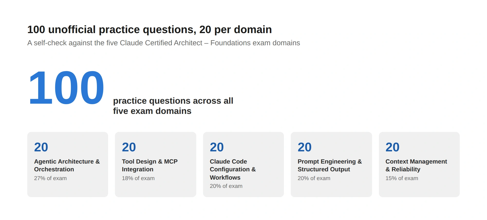

## What this is

This wraps up the **Becoming a Claude Architect** series with a self-check: 100 practice questions, 20 per domain, covering everything from [Domain 1 — Agentic Architecture & Orchestration]() through [Domain 5 — Context Management & Reliability](). Click an answer and you'll see immediately whether it's right, with a short explanation either way.

**This is an unofficial, AI-assisted study aid — not vetted against the real exam's style or difficulty.** I drafted these questions myself, grounded in the official exam guide's task statements and the content of Posts 2 through 6 in this series, but Anthropic hasn't reviewed or endorsed them. Treat this as a way to stress-test your own understanding, not a substitute for the official exam guide or Anthropic's own prep material.

## How to use it


flowchart LR
    A[Read the question] --> B[Pick an answer]
    B --> C{Correct?}
    C -->|Yes| D[Green check + explanation]
    C -->|No| E[Red X on your pick, green check on the right one, + explanation]
    D --> F[Move to the next question]
    E --> G[Re-read the relevant domain post section]
    G --> F

    style D fill:#28c840,stroke:#1c9c30,color:#fff
    style E fill:#e0524a,stroke:#b3261e,color:#fff


No scoring, no shuffling, no timer — just click through all 20 questions in a domain, in order, and see how you do. If a question trips you up, it names the concept clearly enough in the explanation to go back to that domain's post for the fuller version.

## Domain 1 — Agentic Architecture & Orchestration (27%)


Q: In the Claude agentic loop, what does a stop_reason of tool_use signal?
A) The conversation has permanently ended
B) Claude wants to call a tool and expects the result back before continuing
C) An error occurred during generation
D) The context window has been exceeded
CORRECT: B
EXPLAIN: tool_use means Claude has requested a tool call; the loop continues once the tool result is returned, as opposed to end_turn, which signals Claude is done responding.
@@@
Q: In a hub-and-spoke multi-agent architecture, what is the coordinator's primary job?
A) Perform all the detailed work itself for consistency
B) Decompose the task, dispatch subagents, and synthesize their results
C) Store the entire conversation history for every subagent
D) Replace the need for tool use entirely
CORRECT: B
EXPLAIN: The coordinator orchestrates — breaking work into pieces, delegating to subagents, and combining what comes back — rather than doing the heavy work itself.
@@@
Q: Why is it risky to assume a subagent has access to the main conversation's history?
A) Subagents are always slower than the main agent
B) Subagents don't inherit parent context automatically — anything they need must be passed explicitly
C) Subagents can only be called once per session
D) Subagents share the same context window as the coordinator
CORRECT: B
EXPLAIN: A subagent starts with a clean context; whatever it needs from the conversation so far has to be included explicitly in its prompt.
@@@
Q: What is the purpose of allowedTools when configuring a subagent or Task invocation?
A) To speed up token generation
B) To restrict which tools that invocation can use
C) To automatically translate tool outputs
D) To cache tool results across sessions
CORRECT: B
EXPLAIN: allowedTools scopes access to a specific, limited set of tools for that invocation, rather than granting blanket access.
@@@
Q: What is a PreToolUse hook best suited for?
A) Logging a tool's output after it completes
B) Deterministically blocking or modifying a tool call before it executes
C) Summarizing the conversation
D) Selecting which model to use
CORRECT: B
EXPLAIN: A PreToolUse hook runs before execution, so it can enforce a rule deterministically (e.g. blocking a dangerous command) rather than relying on the model to follow a prompt-based instruction.
@@@
Q: Why is hook-based enforcement considered more reliable than prompt-based guidance alone?
A) Hooks run faster than any prompt
B) Hooks are deterministic code that always runs, while a prompt instruction is only probabilistically followed
C) Hooks eliminate the need for tool descriptions
D) Hooks are the only way to call a subagent
CORRECT: B
EXPLAIN: A hook is code that executes every time, unconditionally; a prompt-based instruction depends on the model reliably choosing to follow it.
@@@
Q: When is a fixed pipeline decomposition more appropriate than an adaptive one?
A) When the steps and their order are well understood and repeatable
B) When the task is highly exploratory and the path forward is unclear
C) When no tools are available
D) When only one subagent will ever be used
CORRECT: A
EXPLAIN: A fixed pipeline suits well-understood, repeatable workflows; adaptive decomposition suits open-ended, exploratory tasks where the next step depends on what's discovered.
@@@
Q: What does resume do in a Claude Code session, as distinct from fork_session?
A) It starts an entirely new, unrelated session
B) It continues an existing session's history in place
C) It deletes the prior session's context
D) It merges two unrelated sessions together
CORRECT: B
EXPLAIN: resume picks up an existing session's history and continues it, while fork_session branches off a new session that preserves the original untouched.
@@@
Q: When is forking a session (fork_session) the better choice over resuming?
A) When you want to explore an alternative approach without losing the original thread
B) When you want to permanently delete the original conversation
C) When you need to reduce token costs to zero
D) When the task has no tools involved
CORRECT: A
EXPLAIN: Forking branches off a new path while keeping the original session intact, useful for trying an alternative without committing to it.
@@@
Q: What's the advantage of starting a fresh session with an injected summary rather than resuming the full history?
A) It guarantees identical output to resuming
B) It reduces context size while preserving the essential prior state
C) It disables all hooks
D) It automatically fixes any prior errors
CORRECT: B
EXPLAIN: An injected summary carries forward what matters without the token cost of the full original history — useful when that history has grown large.
@@@
Q: Why should a subagent return a concise, structured result rather than its full raw working transcript?
A) Raw transcripts are not supported by the API
B) It keeps the coordinator's context focused and avoids polluting it with verbose intermediate work
C) Structured results are always factually correct
D) It's required by the MCP specification
CORRECT: B
EXPLAIN: Returning a summary or structured result instead of the full transcript keeps the coordinator's own context window from filling up with noise irrelevant to its synthesis job.
@@@
Q: What's a key criterion for deciding where to split a task into separate subagent calls?
A) Splitting at arbitrary token counts
B) Splitting along natural, independently verifiable units of work
C) Always using exactly two subagents
D) Splitting only when a human requests it
CORRECT: B
EXPLAIN: Good decomposition follows the task's natural boundaries — pieces that can be verified or completed independently — rather than an arbitrary rule.
@@@
Q: What's a common orchestration failure mode in multi-agent systems?
A) Using too few tools per subagent
B) The coordinator blindly trusting a subagent's output without any verification
C) Running subagents in parallel
D) Giving a subagent a narrow, well-scoped toolset
CORRECT: B
EXPLAIN: If a coordinator accepts whatever a subagent reports without any check, an error or hallucination from one subagent can silently propagate through the whole system.
@@@
Q: Why might parallel subagent execution be preferred over sequential execution for independent subtasks?
A) It guarantees lower token usage
B) It reduces wall-clock time when the subtasks don't depend on each other's results
C) It's required by every MCP server
D) It eliminates the need for a coordinator
CORRECT: B
EXPLAIN: Independent subtasks that don't need each other's output can run concurrently, cutting total time compared to running them one after another.
@@@
Q: What should trigger a move from a single-agent to a multi-agent architecture?
A) The task requires distinct, isolatable areas of work or verbose exploration that would pollute a single context
B) The user asks for exactly two responses
C) Any task involving more than one tool call
D) A preference for higher token costs
CORRECT: A
EXPLAIN: Multi-agent architecture pays off when a task naturally splits into isolatable pieces, or when one piece's exploration would otherwise flood the main context with noise.
@@@
Q: In the agentic loop, what typically happens immediately after Claude receives a tool result?
A) The session always ends
B) Claude continues reasoning with the tool result added to its context, potentially calling more tools or finishing
C) The tool result is discarded
D) A new session is automatically created
CORRECT: B
EXPLAIN: The tool result becomes part of the ongoing context, and Claude continues the loop — reasoning further, calling another tool, or producing a final response.
@@@
Q: What is one architect-level reason to prefer several narrowly scoped subagents over one broad, general-purpose agent?
A) It's required by Anthropic's terms of service
B) Narrow scoping improves tool selection reliability and keeps each subagent's context focused
C) It reduces the total number of API calls to zero
D) It removes the need for any orchestration logic
CORRECT: B
EXPLAIN: A narrowly scoped agent has fewer, more relevant tools to choose from and a tighter context, both of which improve reliability.
@@@
Q: What does "task decomposition" refer to in agentic architecture?
A) Deleting parts of a task that seem too hard
B) Breaking a larger task into smaller units suitable for individual agent or subagent execution
C) Reducing the number of available tools to one
D) Converting a task into a single API call
CORRECT: B
EXPLAIN: Decomposition is the process of breaking a task into pieces sized and scoped appropriately for individual execution, whether by the main agent or delegated subagents.
@@@
Q: Which situation most clearly calls for session management via resume rather than starting fresh?
A) The user wants to continue exactly where a long prior session left off, with full history intact
B) The user wants to discard everything and start over
C) The task has no prior context at all
D) The user explicitly wants a smaller context footprint
CORRECT: A
EXPLAIN: resume is for continuing an existing thread with its full history, as opposed to starting fresh or using an injected summary to shrink context.
@@@
Q: Why does the exam guide treat orchestration pattern choice (single agent vs. coordinator/subagent) as an architectural decision rather than a minor implementation detail?
A) Because it has no measurable effect on outcomes
B) Because it directly affects context management, reliability, cost, and how failures propagate through the system
C) Because only one pattern is ever valid
D) Because it's decided automatically by the model
CORRECT: B
EXPLAIN: The orchestration pattern shapes how context is isolated, how errors surface, and how much the system costs to run — all first-order architectural concerns.


## Domain 2 — Tool Design & MCP Integration (18%)


Q: What is the primary mechanism by which an LLM decides whether to call a particular tool?
A) The tool's internal source code
B) The tool's description
C) The order tools were registered in
D) The tool's file size
CORRECT: B
EXPLAIN: The model never reads a tool's implementation — it selects based on the description, which is why vague or overlapping descriptions cause selection errors.
@@@
Q: What's the risk of a minimal tool description like "searches files" when a second, similar tool exists?
A) No risk — minimal descriptions are always sufficient
B) The model can't reliably distinguish which tool to call when their purposes overlap
C) It automatically disables the second tool
D) It causes a compile-time error
CORRECT: B
EXPLAIN: With overlapping, underspecified descriptions, the model has no reliable basis for choosing the right tool for a given request.
@@@
Q: According to the exam guide, what should a well-written tool description include beyond a one-line summary?
A) Input formats, example queries, edge cases, and explicit boundaries of what the tool does and doesn't do
B) Only the tool's return type
C) The name of the engineer who wrote it
D) A list of unrelated tools
CORRECT: A
EXPLAIN: A description that specifies inputs, examples, edge cases, and explicit scope gives the model enough to select and use the tool correctly.
@@@
Q: In MCP, what does isError: true inside a tool result signal?
A) A protocol-level failure that the client should treat as fatal
B) A tool execution error the model can see and potentially recover from
C) That the tool doesn't exist
D) That the server has crashed
CORRECT: B
EXPLAIN: isError: true flags an execution-level failure (like a validation error) inside a normal tool result, specifically so the model can self-correct and retry.
@@@
Q: How do MCP protocol errors differ from tool execution errors?
A) They are identical in every way
B) Protocol errors (e.g. malformed request) are returned as JSON-RPC errors and are less recoverable; execution errors are recoverable via isError
C) Protocol errors are always the model's fault
D) Execution errors can never be retried
CORRECT: B
EXPLAIN: Protocol errors signal something wrong with the request itself at the transport level; execution errors are business-logic failures the model can often work around.
@@@
Q: What does the exam guide recommend beyond the isError flag for architect-level error handling?
A) Ignoring errors to keep the conversation moving
B) Returning structured metadata categorizing the failure type (transient, validation, business, permission) with a retryable flag
C) Always terminating the session on any error
D) Hiding error details from the model entirely
CORRECT: B
EXPLAIN: Categorized, structured error metadata gives the model (or coordinator) enough information to decide how to respond, rather than a flat pass/fail signal.
@@@
Q: Why should a genuine access failure never look the same as a valid-but-empty result?
A) Because they always require the same recovery action
B) Because collapsing them into "no data" leads to the wrong recovery decision
C) Because the MCP spec forbids empty results
D) Because access failures are always transient
CORRECT: B
EXPLAIN: An access failure needs a different response (retry, escalate, check permissions) than a legitimately empty result, so they must be distinguishable.
@@@
Q: What tool-count guidance does the exam guide give, using 18 vs. 4-5 as an example?
A) More tools always improve reliability
B) Giving an agent access to too many tools (e.g. 18 instead of 4-5) degrades tool selection reliability
C) Tool count has no effect on performance
D) Exactly 18 tools is the recommended maximum
CORRECT: B
EXPLAIN: The exam guide uses this contrast to illustrate that tool selection reliability drops as the number of available tools grows unnecessarily large.
@@@
Q: What is "scoped access" in the context of multi-agent tool design?
A) Giving every subagent every available tool
B) Giving each subagent only the tools relevant to its specific role
C) Disabling tool use entirely for subagents
D) Randomly assigning tools to subagents
CORRECT: B
EXPLAIN: Scoped access limits each subagent's toolset to what its role actually needs, improving selection reliability and reducing misuse.
@@@
Q: What does tool_choice: auto do?
A) Forces a specific named tool to be called
B) Lets Claude decide whether to call a tool at all
C) Disables all tools for that request
D) Calls every available tool simultaneously
CORRECT: B
EXPLAIN: auto is the default behavior — Claude decides on its own whether and which tool to use, if any.
@@@
Q: What does tool_choice: any guarantee?
A) That no tool will be called
B) That some tool will be called, though which one is still Claude's choice
C) That the same tool is called twice
D) That tool descriptions are ignored
CORRECT: B
EXPLAIN: any forces a tool call to happen, without pinning down which specific tool — useful when you need some tool action but don't need to name it in advance.
@@@
Q: When would you use a forced tool_choice naming one specific tool?
A) When you need a particular tool invoked first, before Claude reasons about anything else
B) When you never want that tool called
C) When you want to disable tool selection permanently
D) When the tool has no description
CORRECT: A
EXPLAIN: Forcing a specific tool guarantees it's the one called, which matters when a workflow needs a particular action to happen up front.
@@@
Q: What is .mcp.json used for in Claude Code?
A) Personal, non-shared server configuration
B) Project-level MCP server configuration checked into version control and shared with the team
C) A cache of tool call results
D) A user's personal API keys in plaintext
CORRECT: B
EXPLAIN: .mcp.json is committed to the repo, so every team member working on that project gets the same shared MCP tooling automatically.
@@@
Q: What is ~/.claude.json typically used for?
A) Shared team-wide tool configuration
B) User-level, personal, or experimental MCP servers not meant to be committed
C) Storing the project's README
D) Public documentation for the MCP server
CORRECT: B
EXPLAIN: This is the user's personal configuration scope — servers you're testing or that are specific to you, not shared with the team via version control.
@@@
Q: Why does environment variable expansion (e.g. ${API_KEY}) matter for MCP server configuration?
A) It makes the config file load faster
B) It lets credentials stay out of the committed config file, making it safe to check into version control
C) It's required for tool descriptions to render
D) It disables the need for authentication entirely
CORRECT: B
EXPLAIN: With variable expansion, the config file holds the shape of the configuration, not the secret itself, so committing .mcp.json doesn't leak credentials.
@@@
Q: What does the exam guide suggest before building a custom MCP server?
A) Always build custom regardless of alternatives
B) Check for an existing, well-maintained community MCP server first
C) Never use community servers under any circumstances
D) Custom servers are required for every integration
CORRECT: B
EXPLAIN: Reaching for an existing, well-maintained server before building your own avoids duplicating effort and inheriting a maintenance burden.
@@@
Q: When should read-heavy content like a catalog or knowledge base be exposed as an MCP resource rather than a tool?
A) Never — tools are always preferable
B) When it's primarily something to read rather than an action to invoke, since resources fit that shape better than a tool that returns a text blob
C) Only when the content is under 100 words
D) Only for image content
CORRECT: B
EXPLAIN: MCP resources are built for exposing content to be read, which is a better fit than wrapping static or catalog-like data in a tool call.
@@@
Q: Which built-in tool is correct for finding where a specific function is called across a codebase?
A) Glob
B) Grep
C) Write
D) Edit
CORRECT: B
EXPLAIN: Grep searches file contents, which is what's needed to find where a function is referenced, as opposed to Glob's file-path pattern matching.
@@@
Q: Which built-in tool is correct for finding all files matching *.test.ts across a project?
A) Grep
B) Glob
C) Read
D) Edit
CORRECT: B
EXPLAIN: Glob matches file paths by pattern; it's the right tool for finding files by name or extension rather than by their contents.
@@@
Q: Why is Edit preferred over Read+Write for a small, targeted code change?
A) Edit is always faster regardless of file size
B) Edit makes an in-place, targeted modification instead of requiring a full file rewrite
C) Read+Write is not supported by Claude Code
D) Edit does not require specifying the file path
CORRECT: B
EXPLAIN: Edit changes only the targeted portion of a file, which is more precise and less error-prone than reading the whole file and rewriting it for a small change.


## Domain 3 — Claude Code Configuration & Workflows (20%)


Q: In the CLAUDE.md hierarchy, which scope loads first (broadest)?
A) Project-level ./CLAUDE.md
B) An organization-wide managed policy file
C) CLAUDE.local.md
D) User-level ~/.claude/CLAUDE.md
CORRECT: B
EXPLAIN: The managed policy file is IT-controlled and organization-wide, loading before user-level, then project-level, then local instructions.
@@@
Q: What is CLAUDE.local.md typically used for?
A) Organization-wide policy shared with every team
B) A gitignored file for personal, project-specific preferences that shouldn't be committed
C) The only place tool descriptions can be defined
D) A required file for every Hugo site
CORRECT: B
EXPLAIN: CLAUDE.local.md holds preferences specific to one person's work on a project, kept out of version control via .gitignore.
@@@
Q: What is the maximum nesting depth for the @path/to/file import syntax in CLAUDE.md?
A) Unlimited
B) 4 hops
C) 1 hop only
D) 10 hops
CORRECT: B
EXPLAIN: Imports can nest up to four hops deep, letting a CLAUDE.md pull in other files without duplicating their content, but not indefinitely.
@@@
Q: Where do user-scoped custom commands live, as opposed to project-scoped ones?
A) .claude/commands/ (project) vs ~/.claude/commands/ (user)
B) Both live in the same folder always
C) User commands can only be defined in CLAUDE.md
D) There is no distinction between the two scopes
CORRECT: A
EXPLAIN: Project commands are checked into version control and shared with the team; user commands are personal and live under the user's home directory.
@@@
Q: What does setting context: fork in a skill's frontmatter do?
A) Disables the skill entirely
B) Runs the skill in an isolated subagent with no visibility into the main conversation's history
C) Forces the skill to run twice
D) Grants the skill access to every tool permanently
CORRECT: B
EXPLAIN: context: fork isolates a self-contained task, like a code review, from the main conversation's context, running it in its own subagent.
@@@
Q: What does allowed-tools in a skill's frontmatter control, and how long does the grant last?
A) It permanently grants every tool; the grant never expires
B) It pre-approves a specific, scoped set of tools for that invocation, and the grant clears after the next message
C) It disables all tools for that skill
D) It only applies to MCP servers, never built-in tools
CORRECT: B
EXPLAIN: allowed-tools scopes tool access to a specific set for one invocation, and that access doesn't persist indefinitely — it clears after the following message.
@@@
Q: What field in a .claude/rules/ file's YAML frontmatter controls when that rule loads?
A) title
B) paths (a glob pattern)
C) author
D) version
CORRECT: B
EXPLAIN: The paths glob pattern determines which files must be in play for that rule to enter context, keeping unrelated rules from loading unnecessarily.
@@@
Q: What is the main benefit of path-scoped rules over one large CLAUDE.md?
A) They eliminate the need for any project documentation
B) They keep context usage down by loading only when relevant files are being touched
C) They automatically fix bugs in the matched files
D) They replace the need for tool descriptions
CORRECT: B
EXPLAIN: A rule scoped to src/api/**/*.ts only enters context when you're actually working with matching files, rather than loading on every session regardless of relevance.
@@@
Q: When is plan mode most appropriate?
A) For a one-line typo fix
B) For complex, multi-file changes where the right approach is uncertain
C) Only when no tools are needed
D) Never — it should always be skipped
CORRECT: B
EXPLAIN: Plan mode's overhead (reading, reasoning, proposing before acting) pays off on uncertain or large-scale work, not on simple, well-understood changes.
@@@
Q: What's the practical test for whether to skip plan mode and execute directly?
A) Whether the change touches more than 10 files
B) Whether you could describe the diff in one sentence
C) Whether the user is watching
D) Whether any tool is required at all
CORRECT: B
EXPLAIN: If the change is simple enough to describe in a single sentence, plan mode's proposal step is unnecessary overhead.
@@@
Q: What is the "interview pattern" used for in iterative refinement?
A) Having Claude ask about technical implementation, UI/UX, and edge cases before writing a spec for a larger feature
B) Testing the user's knowledge of Claude Code
C) Replacing the need for any planning
D) Automatically generating unit tests
CORRECT: A
EXPLAIN: The interview pattern surfaces considerations the user might not think to mention upfront, before implementation begins on a larger feature.
@@@
Q: Why is test-driven iteration considered stronger than stopping once work "looks done"?
A) Because tests are required by Hugo
B) Because Claude runs a real check (tests, a build, a comparison) and keeps iterating until it actually passes
C) Because it eliminates the need for code review
D) Because it guarantees zero bugs
CORRECT: B
EXPLAIN: A real, objective check catches issues that visual inspection alone would miss, and iteration continues until that check actually passes.
@@@
Q: What does the -p (or --print) flag enable in Claude Code?
A) Printing the conversation to a physical printer
B) Non-interactive execution, usable inside CI pipelines, pre-commit hooks, or scripts
C) Disabling all tool use
D) Switching to a different model permanently
CORRECT: B
EXPLAIN: -p runs Claude Code non-interactively, which is what makes it usable in automated contexts like CI rather than only an interactive terminal session.
@@@
Q: What does --output-format json provide when paired with -p?
A) A random sampling of the response
B) A structured response a pipeline can parse programmatically instead of scraping plain text
C) Disabling of all output
D) Automatic translation to another language
CORRECT: B
EXPLAIN: Structured JSON output lets a CI pipeline or script consume Claude Code's response reliably, rather than parsing free-form text.
@@@
Q: Providing input/output examples ("this input should produce that output") is an example of which iteration technique?
A) Test-driven iteration
B) The interview pattern
C) Giving Claude something concrete to check its own work against, instead of describing behavior abstractly
D) Plan mode
CORRECT: C
EXPLAIN: Concrete examples give Claude a direct target to match, which is more reliable than an abstract description of desired behavior.
@@@
Q: Relative to what are @path/to/file imports in CLAUDE.md resolved?
A) The project's root directory always
B) The file that references them
C) The user's home directory always
D) A fixed absolute path defined by Anthropic
CORRECT: B
EXPLAIN: Import paths resolve relative to the file doing the importing, not a single fixed root, which matters when nesting imports across directories.
@@@
Q: What's the risk of putting highly detailed, workflow-specific instructions directly into a single large CLAUDE.md instead of a skill?
A) There is no risk — CLAUDE.md has unlimited capacity
B) Those tokens load into context on every session even when irrelevant to the current task
C) CLAUDE.md instructions are ignored by Claude Code
D) It automatically breaks the @import syntax
CORRECT: B
EXPLAIN: Content loaded into CLAUDE.md is present every session regardless of relevance; a skill loads on demand only when actually invoked.
@@@
Q: Why does plan mode require explicit approval before any files are touched?
A) Because Claude Code cannot edit files without approval under any workflow
B) Because it gives the user a chance to catch a wrong approach before any changes are made
C) Because it's a legal requirement
D) Because plan mode disables all editing permanently
CORRECT: B
EXPLAIN: The approval step is what makes plan mode valuable — catching a misdirected plan before it costs any actual edits.
@@@
Q: What is a key difference between a project-level slash command and a user-level one?
A) Project commands are shared with the team via version control; user commands are personal
B) User commands can never call tools
C) Project commands only work in CI
D) There is no functional difference
CORRECT: A
EXPLAIN: The project scope is checked into the repo and shared; the user scope is personal to that individual across all their projects.
@@@
Q: Why does CI/CD integration matter as an architect-level Claude Code skill?
A) It has no practical application outside interactive sessions
B) It lets Claude Code run automated checks (like a diff linter or log summarizer) as part of a pipeline rather than only interactively
C) It replaces the need for any human review
D) It is only usable with the Opus model
CORRECT: B
EXPLAIN: Headless execution via -p turns Claude Code into a component usable inside automated pipelines, extending its value well beyond a single interactive session.


## Domain 4 — Prompt Engineering & Structured Output (20%)


Q: What does the "brilliant but new employee" framing in Claude's prompting docs recommend?
A) Assume Claude already knows your team's unstated norms
B) Give Claude explicit context and criteria, since it has no implicit knowledge of your expectations
C) Avoid giving any examples
D) Keep instructions as vague as possible
CORRECT: B
EXPLAIN: Treating Claude like a smart newcomer with no context means spelling out criteria explicitly rather than assuming shared, unstated norms.
@@@
Q: Why does "Report security vulnerabilities and logic errors; skip style preferences" outperform "Review this code"?
A) It's shorter
B) It gives explicit, verifiable criteria for what counts as worth flagging
C) It uses more technical vocabulary
D) It avoids using any punctuation
CORRECT: B
EXPLAIN: The explicit version tells Claude exactly what to look for and what to ignore, removing the guesswork the vague version leaves behind.
@@@
Q: What is few-shot (multishot) prompting primarily used for?
A) Reducing the total number of tokens in a prompt
B) Steering output format, tone, and structure more reliably than abstract description alone
C) Disabling tool use
D) Bypassing the need for a system prompt
CORRECT: B
EXPLAIN: Claude generalizes from concrete examples more reliably than from purely abstract rules, which is why examples are so effective at steering output.
@@@
Q: For an ambiguous extraction task, how many well-chosen examples does the exam guide suggest?
A) 0
B) 2-4
C) 50
D) Exactly 1, never more
CORRECT: B
EXPLAIN: A small number of well-chosen, targeted examples — 2 to 4 — covering ambiguous or edge cases does more to reduce hallucination than a long written specification.
@@@
Q: What is the purpose of wrapping few-shot examples in <example> tags?
A) To make them load faster
B) To clearly mark them off from the rest of the prompt so they read as demonstrations, not instructions
C) To disable them by default
D) To convert them into JSON automatically
CORRECT: B
EXPLAIN: Explicit tagging keeps the model from confusing an illustrative example with a literal instruction to follow verbatim.
@@@
Q: Why should few-shot examples be diverse rather than all similar to each other?
A) Diversity has no effect on output quality
B) Diverse examples covering edge cases prevent Claude from locking onto one unintended pattern
C) Diverse examples are required by the API
D) It reduces the number of tokens needed
CORRECT: B
EXPLAIN: If every example looks alike, Claude may overfit to that narrow pattern rather than generalizing correctly across the range of real inputs.
@@@
Q: What does tool use with a JSON schema (especially strict: true) guarantee that prompting for JSON in plain text does not?
A) Faster response times in every case
B) Schema-compliant output through constrained decoding, avoiding parsing errors from a malformed shape
C) Zero cost per request
D) Unlimited output length
CORRECT: B
EXPLAIN: Constrained decoding under strict mode enforces the schema at generation time, which plain-text JSON requests can't guarantee.
@@@
Q: When source documents might not contain every field a schema defines, what's the recommended design choice?
A) Force Claude to fabricate a plausible value for the missing field
B) Make those fields optional (leave them out of required) rather than forcing fabrication
C) Reject the document entirely
D) Always default missing fields to zero
CORRECT: B
EXPLAIN: Marking uncertain fields optional lets Claude omit what genuinely isn't present instead of inventing a value just to satisfy the schema.
@@@
Q: What's a key risk of relying only on prose instructions ("please respond in JSON") for structured output, without tool use?
A) None — prose instructions are just as reliable as schema-enforced tool use
B) The output can still be malformed or fail to parse, since nothing enforces the shape at generation time
C) It automatically triggers a validation error
D) It disables extended thinking
CORRECT: B
EXPLAIN: Without schema enforcement via tool use, a text-only request for JSON can still come back malformed, requiring a parser to catch what should have been prevented upstream.
@@@
Q: What is the stronger pattern when a validation check fails on generated output?
A) Silently discard the output and move on
B) Append the specific validation error to the prompt on retry, so Claude sees exactly what was wrong
C) Resend the identical prompt unchanged
D) Immediately escalate to a human with no retry
CORRECT: B
EXPLAIN: Feeding back the specific failure lets Claude correct the actual problem, rather than guessing again from an unchanged prompt.
@@@
Q: How do semantic errors differ from syntax errors in validation?
A) They are the same thing
B) Semantic errors mean the data itself is wrong (an implausible value); syntax errors mean the shape is wrong (malformed JSON, missing key)
C) Syntax errors can never be caught automatically
D) Semantic errors only occur with tool use
CORRECT: B
EXPLAIN: The two error types call for different feedback — a semantic error needs correction of a value, a syntax error needs correction of structure.
@@@
Q: What does tracking recurring error types across many retries help identify?
A) Nothing useful — retries should always look identical
B) Whether the schema or prompt itself needs to change, not just the retry logic
C) The exact API latency
D) Which model version is running
CORRECT: B
EXPLAIN: A pattern of the same error recurring points to a deeper problem in the prompt or schema design, not something a smarter retry alone can fix.
@@@
Q: What is a structural limitation of a model reviewing its own generated output?
A) Self-review is always more accurate than independent review
B) The model retains the context from generating the work, making it less likely to question its own choices
C) Self-review is not technically possible
D) Self-review always takes longer than independent review
CORRECT: B
EXPLAIN: Having just produced the work, the model is primed to confirm rather than interrogate its own choices.
@@@
Q: Why does an independent review instance often catch more than self-review?
A) It has no memory of writing the work, so it has nothing invested in the original approach
B) It always uses a larger model
C) It automatically has access to more tools
D) It skips validation entirely
CORRECT: A
EXPLAIN: A fresh instance with no stake in the original generation can scrutinize it more objectively than the instance that produced it.
@@@
Q: In multi-pass review for large reviews, what's the difference between a local pass and an integration pass?
A) There is no difference
B) A local pass checks each piece on its own; an integration pass checks how the pieces fit together
C) A local pass only checks spelling
D) An integration pass is always skipped
CORRECT: B
EXPLAIN: Splitting review into local and integration passes catches both per-piece issues and cross-file/cross-component issues that a single pass would likely miss.
@@@
Q: Roughly how much cost savings does the Message Batches API offer compared to standard pricing?
A) No savings at all
B) Roughly 50% off standard token pricing
C) 99% off
D) It costs more than standard requests
CORRECT: B
EXPLAIN: Batches trade immediacy for cost, offering roughly half the price of standard synchronous requests.
@@@
Q: What is the maximum processing window for the Message Batches API?
A) 1 minute
B) 24 hours
C) 7 days
D) There is no maximum
CORRECT: B
EXPLAIN: Batches have a maximum 24-hour processing window, though most complete well within an hour.
@@@
Q: What is the purpose of custom_id in a batch request?
A) To set the model's temperature
B) To identify and match individual results, since batch results return in arbitrary order
C) To encrypt the request
D) To set a spending limit
CORRECT: B
EXPLAIN: Because batch results don't come back in submission order, custom_id is what lets you match each result to its original request and selectively resubmit failures.
@@@
Q: What kind of workload is the Message Batches API best suited for?
A) A live chat interface where the user is waiting in real time
B) Latency-tolerant, high-volume work like bulk extraction or large-scale evaluation
C) A single, one-off request
D) Anything requiring sub-second response time
CORRECT: B
EXPLAIN: Batches are built for non-blocking, high-volume work where no one is waiting on an immediate response — the opposite of a live interactive use case.
@@@
Q: What's the recommended approach if a batch request fails with a validation-type error rather than a server error?
A) Resubmit the entire batch unchanged
B) Use custom_id to identify and selectively resubmit just the failed requests, likely with a correction
C) Discard the whole batch permanently
D) Switch models and resubmit everything
CORRECT: B
EXPLAIN: custom_id lets you isolate and fix just the failed requests rather than re-running the entire batch, which is both faster and cheaper.


## Domain 5 — Context Management & Reliability (15%)


Q: What information is most at risk of being lost during progressive summarization of a long conversation?
A) The overall topic of the conversation
B) Numerical values, dates, and a customer's exact stated expectations
C) The name of the model being used
D) The total token count
CORRECT: B
EXPLAIN: Precise, concrete details are exactly what get smoothed away into vague prose when a conversation is repeatedly summarized.
@@@
Q: What does the "lost in the middle" effect describe?
A) Models perform equally well regardless of where information sits in a long input
B) Information buried in the middle of a long input is less reliably used than content near the start or end
C) A bug that only affects the last message
D) A caching failure specific to tool use
CORRECT: B
EXPLAIN: Content near the beginning or end of a long input tends to be attended to more reliably than content buried deep in the middle.
@@@
Q: What is the purpose of extracting transactional facts into a persistent "case facts" block?
A) To make the conversation transcript shorter for display purposes only
B) To preserve hard facts independently of the narrative summary, which can drift or lose detail over time
C) To replace the need for any summarization
D) To satisfy a formatting requirement with no functional benefit
CORRECT: B
EXPLAIN: A structured, persistent record of the actual facts survives independently of whatever happens to the running narrative summary.
@@@
Q: Why should verbose tool output be trimmed before it accumulates, rather than after?
A) Trimming after accumulation is always more efficient
B) Once verbose output has piled up across many turns, it consumes a disproportionate share of context relative to its value
C) Tool output cannot be trimmed after the fact under any circumstances
D) It has no effect on token usage either way
CORRECT: B
EXPLAIN: Proactive trimming keeps verbose results from silently eating context budget turn after turn, rather than dealing with the accumulated cost later.
@@@
Q: Why is putting summaries at the beginning of a prompt recommended?
A) It has no measurable effect
B) It works with the lost-in-the-middle effect rather than against it, since content near the start is used more reliably
C) It's required by the API
D) It reduces the number of tool calls
CORRECT: B
EXPLAIN: Placing the summary where it's most reliably attended to counters the tendency for buried mid-prompt content to be underused.
@@@
Q: Why are sentiment analysis and confidence scores considered unreliable signals for triggering escalation to a human?
A) They are always 100% accurate
B) A case can appear calm while actually being stuck, or appear anxious while being straightforward to resolve
C) They are not technically possible to compute
D) They only work for text in English
CORRECT: B
EXPLAIN: Tone and confidence don't reliably track whether a case is actually resolvable, which is why explicit criteria are preferred over these heuristics.
@@@
Q: What does the exam guide recommend for defining escalation triggers?
A) Rely purely on the model's intuition with no explicit criteria
B) Explicit escalation criteria backed by few-shot examples
C) Escalate every single request regardless of context
D) Never escalate under any circumstances
CORRECT: B
EXPLAIN: Concrete criteria paired with examples give a much more reliable escalation trigger than an implicit, criteria-free judgment call.
@@@
Q: How should an explicit customer request for a human agent be handled?
A) Ignored if the issue seems resolvable
B) Honored immediately, regardless of whether the issue looks resolvable
C) Escalated only after three more exchanges
D) Treated the same as any other low-priority request
CORRECT: B
EXPLAIN: An outright request for a human is honored right away — it isn't something to work around even if the agent believes it could resolve the issue itself.
@@@
Q: What should happen when multiple customer records plausibly match the available identifying information?
A) Automatically select the most recently active record
B) Request an additional identifier to disambiguate rather than guessing
C) Merge all matching records together
D) Escalate immediately without asking anything
CORRECT: B
EXPLAIN: Heuristic selection among ambiguous matches is unreliable; asking for one more identifier resolves the ambiguity properly.
@@@
Q: What should a subagent return when it fails, beyond a bare "failed" status?
A) Nothing — a bare status is sufficient
B) Structured error context including failure type and what alternatives exist
C) The full internal stack trace with no summary
D) A random retry count
CORRECT: B
EXPLAIN: Structured context — what kind of failure, and what alternatives are available — is what actually lets a coordinator make an intelligent recovery decision.
@@@
Q: Why must a genuine access failure be distinguishable from a valid-but-empty result?
A) Because they always require identical handling
B) Because collapsing both into "no data" leads a coordinator to make the wrong recovery decision
C) Because the MCP specification disallows empty results
D) Because access failures are always permanent
CORRECT: B
EXPLAIN: An access failure might call for a retry or escalation; a legitimately empty result doesn't — conflating them breaks the coordinator's ability to respond correctly.
@@@
Q: Before propagating a failure up to the coordinator, what should a subagent attempt?
A) Nothing — always propagate immediately
B) Local recovery, if possible, before escalating the failure upward
C) Terminate the entire multi-agent workflow
D) Silently suppress the error
CORRECT: B
EXPLAIN: Attempting recovery locally first avoids escalating problems that the subagent could have resolved on its own.
@@@
Q: What should synthesis output include when some subagent results are incomplete or missing?
A) Nothing — present the available results as if they were complete
B) Coverage annotations noting the gaps, rather than silently presenting partial results as complete
C) A generic apology with no specifics
D) An automatic retry loop with no user visibility
CORRECT: B
EXPLAIN: Annotating coverage gaps keeps the consumer of the synthesized output from mistaking a partial result for a complete one.
@@@
Q: What does the exam guide say happens to answer consistency in extended Claude Code sessions?
A) It always improves the longer the session runs
B) Context degradation in extended sessions can produce inconsistent answers
C) It is completely unaffected by session length
D) It only affects sessions using MCP servers
CORRECT: B
EXPLAIN: The exam guide names this directly — long sessions can accumulate enough context noise to make answers less consistent over time.
@@@
Q: What is the purpose of a scratchpad file during large codebase exploration?
A) To store the user's personal notes unrelated to the task
B) To persist key findings across context boundaries so they survive even if the session doesn't
C) To disable further exploration
D) To replace the need for any subagents
CORRECT: B
EXPLAIN: A scratchpad captures findings in a durable, external form, so they aren't lost if the session's context gets compacted or restarted.
@@@
Q: Why delegate verbose codebase exploration to subagents rather than doing it in the main conversation?
A) It has no effect on context usage
B) It isolates the noise of searching so only a summary returns to the main conversation
C) It's required by every MCP server
D) It disables the main agent's tool access
CORRECT: B
EXPLAIN: The verbose back-and-forth of exploring a large codebase stays in the subagent's own context, keeping the main conversation focused.
@@@
Q: What does the /compact command do in an extended Claude Code session?
A) Deletes the entire session with no recovery
B) Reclaims context space by summarizing older history, optionally guided by instructions about what to preserve
C) Disables all further tool use
D) Switches to a different model automatically
CORRECT: B
EXPLAIN: /compact frees up space by summarizing history, and can be pointed at what matters most to keep, rather than guessing blindly.
@@@
Q: Why is stratified random sampling preferred over a single aggregate accuracy metric?
A) An aggregate number can hide poor performance on a specific segment that a stratified sample would reveal
B) Stratified sampling always produces a higher accuracy number
C) Aggregate metrics are technically impossible to compute
D) Stratified sampling eliminates the need for any human review
CORRECT: A
EXPLAIN: A high overall accuracy figure can mask a model performing poorly on one document type or segment — stratified sampling surfaces that gap.
@@@
Q: What are field-level confidence scores calibrated against, according to the exam guide?
A) Nothing — they are generated arbitrarily
B) A labeled dataset, so scores can be trusted to route low-confidence extractions to human review
C) The total number of API calls made
D) The model's context window size
CORRECT: B
EXPLAIN: Calibration against labeled data is what makes a confidence score meaningful enough to use as a routing signal for human review.
@@@
Q: Why do structured claim-source mappings matter in multi-source synthesis?
A) They have no practical benefit
B) They preserve provenance (URL, excerpt, date) that would otherwise be lost the moment a fact is summarized without its origin
C) They are required only for legal documents
D) They eliminate the need for any citations
CORRECT: B
EXPLAIN: Without a structured mapping back to its source, a synthesized fact loses its provenance — where it came from, and when — which matters for trust and verification.


## Conclusion

That's the series: five domains, thirty-one key points, five diagrams, five charts, and now a hundred questions to check what stuck. The Claude Certified Architect – Foundations exam tests real architectural judgment — when to reach for a subagent versus doing the work inline, how to design a tool description that a model can actually parse correctly, when plan mode earns its overhead, how to guarantee structured output instead of hoping for it, and how to keep a long-running agent honest about what it does and doesn't know. If this quiz surfaced a gap, the linked domain posts above are the fastest way to close it.

## Sources

- [Claude Certified Architect – Foundations Exam Guide](https://everpath-course-content.s3-accelerate.amazonaws.com/instructor%2F6nizmqk8tpzpfjvt6qmmav7rh%2Fpublic%2F1783542750%2FClaude+Certified+Architect+%E2%80%93+Foundations+Exam+Guide.pdf) — task statements for all five domains
- [Becoming a Claude Architect series]() — Parts 1 through 6, the primary source for every question above

These 100 questions are AI-drafted and AI-checked against the domain posts' own content and the exam guide; I reviewed them for accuracy and fit, but they haven't been validated against the real exam's actual question style or difficulty.

## Where this fits

Part 7 — the finale — of **Becoming a Claude Architect**, following [Domain 5 — Context Management & Reliability](). That's the full series: [Part 1 — Overview]() through this practice quiz.
