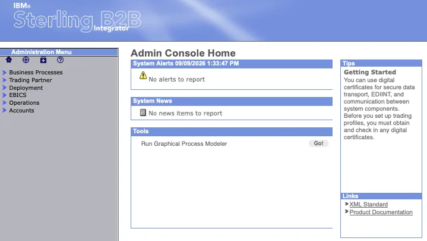
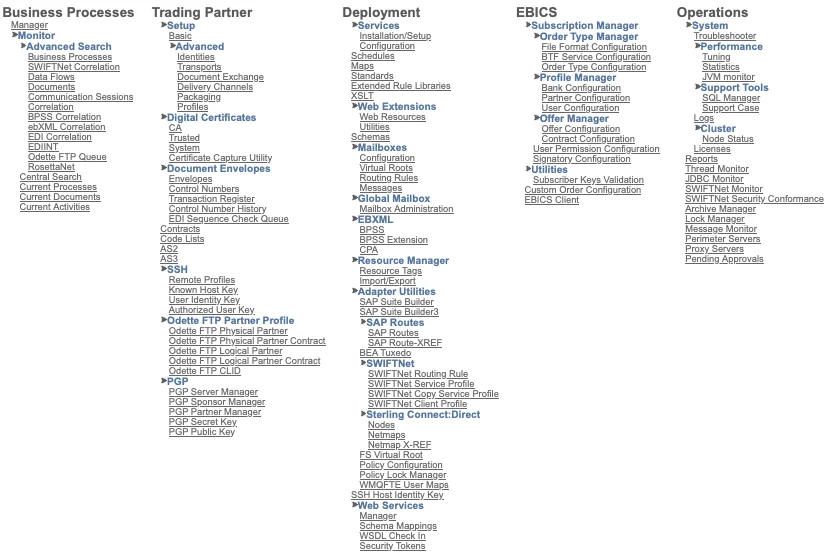
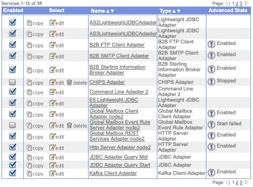
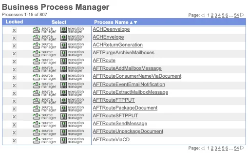
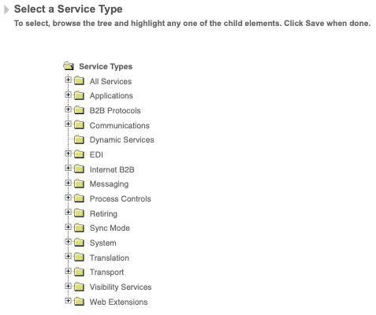
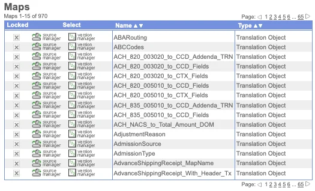
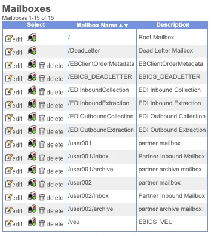
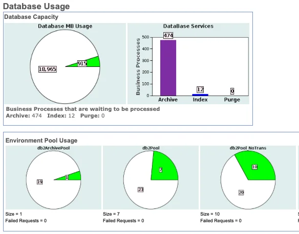

## O que é o IBM B2Bi

O IBM Sterling B2B Integrator faz um trabalho: mover arquivos entre a sua empresa e seus parceiros comerciais — bancos, fornecedores, transportadoras, quem quer que precise trocar documentos EDI, arquivos planos ou XML de forma confiável e rastreável — e saber exatamente o que aconteceu com cada arquivo em cada etapa. Só isso. Tudo o mais existe para sustentar esse único trabalho.

A própria visão geral da IBM coloca isso de forma direta: o B2Bi é construído para gerenciar "as dinâmicas técnicas e humanas dos relacionamentos entre parceiros de negócio" ([Documentação IBM](https://www.ibm.com/docs/en/b2b-integrator/6.2.0?topic=glance-sterling-b2b-integrator)). Na prática, "dinâmicas técnicas e humanas" significa que o software precisa tolerar parceiros que enviam arquivos malformados, mudam os dados de conexão sem aviso e, ocasionalmente, somem por uma semana durante as festas de fim de ano — enquanto a sua trilha de auditoria continua precisando se sustentar.

## Componentes do IBM B2Bi

Decorar uma lista de componentes nunca funcionou para mim, mas rastrear um arquivo do início ao fim funcionou. Para dar uma ideia da escala, aqui está a árvore completa do menu de administração — tudo abaixo é um ramo dela:

### Perimeter Server

A conexão de um parceiro não chega direto ao motor principal (core engine). Ela cai em um **[Perimeter Server](https://www.ibm.com/docs/en/b2b-integrator/6.2.0?topic=servers-perimeter-in-sterling-b2b-integrator)** que fica na DMZ, responsável por fazer o handshake de protocolo de fato (SFTP, AS2, HTTP) e encaminhar o tráfego para dentro por um canal seguro. A maioria do material introdutório ignora isso completamente, o que é uma pena, porque é exatamente o motivo pelo qual você consegue expor endpoints voltados a parceiros sem nunca colocar o seu motor principal perto da internet pública. Se você já se perguntou por que um diagrama de implantação do Sterling tem caixas fora do firewall, é por isso — e o assunto merece um post próprio mais adiante nesta série: a [Parte 6]() cobre exatamente como essa caixa na DMZ conversa com o motor principal.

### Adapters

A partir daí, um **Adapter** assume. Adapters são propositalmente estreitos em escopo — SFTP, AS2, Connect:Direct, HTTP/S, JDBC e mais algumas dezenas — e cada um faz exatamente uma coisa: receber ou enviar um arquivo pelo seu protocolo específico, e então entregá-lo a um Business Process.

### Business Process

É nessa passagem de bastão que as coisas ficam interessantes. Um **Business Process** é um fluxo de trabalho — modelado visualmente no Graphical Process Modeler, armazenado por baixo em [BPML](https://www.ibm.com/docs/en/b2b-integrator/6.2.0?topic=integrator-business-processes) (Business Process Markup Language) — que encadeia etapas: validar isso, mapear aquilo, criptografar isso, rotear, avisar alguém se der errado. Praticamente tudo que importa no B2Bi acontece dentro de um Business Process. É a coisa mais parecida com um coração que a plataforma tem.

### Services

Dentro desse processo, os **Services** fazem o trabalho interno — mapeamento, validação, extração, compressão, lógica customizada — enquanto os Adapters continuam cuidando do mundo externo. Um Business Process, resumido ao essencial, é basicamente uma sequência de chamadas de Adapter e Service, com ramificações para quando algo dá errado (e em produção, algo sempre acaba dando errado).

### Map

Em algum ponto dessa sequência, um **Map** normalmente entra em ação. Parceiros quase nunca enviam os dados no formato que você realmente precisa — EDI para XML, arquivo plano para JSON, o que quer que o sistema downstream espere — e essa tradução acontece no Map Editor, que é profundo o suficiente para merecer seu próprio post mais adiante nesta série. Não estou exagerando quando digo que alguns dos bugs mais complicados que já persegui começaram como "o map fez alguma coisa estranha com um campo nulo".

### Mailbox

O arquivo geralmente cai em uma **Mailbox** — uma caixa de entrega segura e com permissões dentro do B2Bi. É aqui que vejo mais confusão, mesmo entre quem usa o Sterling há anos: o File Gateway não é um produto separado concorrendo com o B2Bi. É uma camada de UI e roteamento construída especificamente sobre a estrutura de mailbox e adapters do B2Bi, feita justamente para que a troca de arquivos com parceiros possa ser gerenciada sem que ninguém precise mexer diretamente em BPML (vale a pena ler a [visão geral do File Gateway da IBM](https://www.ibm.com/docs/en/b2b-integrator/6.2.0?topic=glance-sterling-file-gateway) se isso for novidade para você).

### Database

E por baixo de tudo isso está o **Database** — o estado de cada Business Process, o histórico de rastreamento de cada documento, a trilha de auditoria completa. Fácil de dar como garantido até a sua primeira interrupção real, quando os dados de rastreamento de documentos se tornam o único registro honesto do que de fato aconteceu com um arquivo. Já reconstruí mais de uma linha do tempo de incidente usando só essa tabela.

Para ambientes de produção que não toleram indisponibilidade, o B2Bi também suporta **Clustering** multi-node — vale saber que existe, ainda que não seja algo que você precise no primeiro dia.

## Desenho da topologia

Aqui está a arquitetura em uma única imagem:


flowchart TB
    subgraph Partners["Parceiros Comerciais"]
        P1["Parceiro A"]
        P2["Parceiro B"]
    end

    subgraph DMZ["DMZ"]
        PS["Perimeter Server"]
    end

    subgraph Core["Núcleo do B2B Integrator"]
        AD["Adapters SFTP / AS2 / Connect:Direct / HTTP"]
        BP["Business Processes (Motor BPML)"]
        SV["Services Mapeamento / Validação / Roteamento"]
        MB["Mailboxes"]
        FG["File Gateway (camada de UI sobre as Mailboxes)"]
    end

    DB[("Database Rastreamento de Documentos & Estado")]

    P1 --> PS
    P2 --> PS
    PS --> AD
    AD --> BP
    BP --> SV
    SV --> MB
    FG -.gerencia.-> MB
    BP <--> DB
    MB <--> DB


E aqui está a mesma ideia como uma linha do tempo, já que um diagrama estático não captura bem que tudo isso acontece como uma sequência de passagens de bastão discretas — útil quando você está tentando descobrir qual log checar primeiro:


sequenceDiagram
    participant Partner as Parceiro
    participant PS as Perimeter Server
    participant AD as Adapter
    participant BP as Business Process
    participant MB as Mailbox
    participant DB as Database

    Partner->>PS: Conecta (SFTP/AS2/HTTP)
    PS->>AD: Encaminha arquivo por canal seguro
    AD->>BP: Dispara o Business Process
    BP->>BP: Executa Services (mapear, validar, rotear)
    BP->>DB: Registra o estado de rastreamento do documento
    BP->>MB: Entrega o arquivo
    MB->>DB: Registra o status de entrega
    Note over Partner,DB: Cada seta acima é um ponto onde o arquivo pode falhar — e um lugar onde o rastreamento de documentos vai mostrar o motivo


Essa nota no final é, na verdade, o ponto central deste post inteiro: uma vez que você consegue visualizar o caminho real do arquivo, a resolução de problemas deixa de ser tentativa e erro. Você simplesmente percorre o diagrama de trás para frente, a partir de onde o arquivo parou.

## Fontes

Prefiro te direcionar para a documentação oficial da IBM do que parafraseá-la mal, então aqui está o que usei como base para este post — todas páginas oficiais da Documentação IBM, que vale a pena salvar independentemente de você acompanhar esta série:

- [Sterling B2B Integrator — Visão Geral](https://www.ibm.com/docs/en/b2b-integrator/6.2.0?topic=glance-sterling-b2b-integrator)
- [Visão Geral Arquitetural](https://www.ibm.com/docs/en/b2b-integrator/6.2.0?topic=overview-architectural)
- [Perimeter servers no Sterling B2B Integrator](https://www.ibm.com/docs/en/b2b-integrator/6.2.0?topic=servers-perimeter-in-sterling-b2b-integrator)
- [Business Processes](https://www.ibm.com/docs/en/b2b-integrator/6.2.0?topic=integrator-business-processes)
- [Sterling File Gateway — Visão Geral](https://www.ibm.com/docs/en/b2b-integrator/6.2.0?topic=glance-sterling-file-gateway)
- [Criando uma Mailbox do Sterling B2B Integrator](https://www.ibm.com/docs/en/b2b-integrator/6.0.2?topic=interoperability-creating-sterling-b2b-integrator-mailbox)

Tudo o mais neste post — o enquadramento, o conselho de "qual log checar primeiro", as histórias de guerra — vem de realmente operar isso em produção nos últimos anos, não de um manual.

## O que vem a seguir

A seguir nesta série: **Adapters vs. Services** — a distinção que confunde quase todo mundo nas primeiras semanas com o Sterling, e a que mais importa quando você está resolvendo um problema às 2 da manhã.
