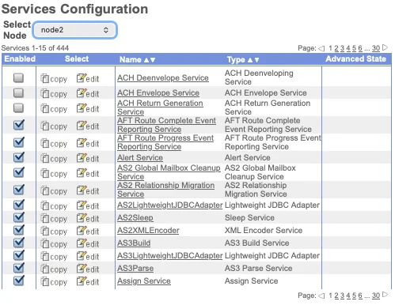
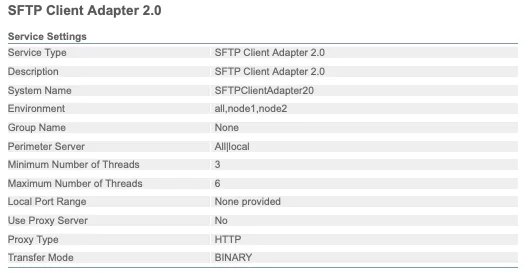
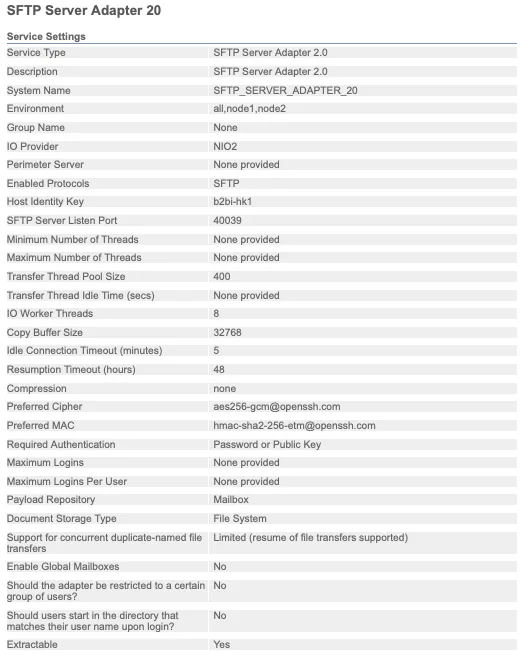
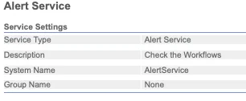
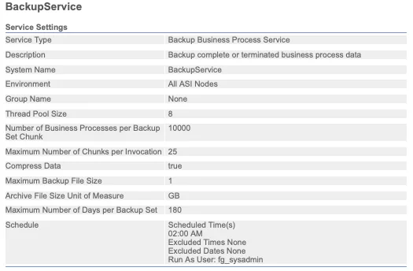

## What is an Adapter

An **Adapter** is a service whose entire job is reaching outside Sterling B2B Integrator — connecting the Business Process Engine to "dissimilar systems and applications" that live outside the environment ([IBM Documentation](https://www.ibm.com/docs/en/b2b-integrator/6.2.0?topic=integrator-services-adapters)). An SFTP adapter opens a connection to a partner's SFTP server. An AS2 adapter speaks the AS2 protocol to a trading partner's gateway. Same underlying mechanism as any other service — the Business Process Engine calls it, it runs, it returns a result — but the work itself happens somewhere else, over a network, against a system you don't control.

## What is a Service

A **Service** is the broad category: any set of instructions the Business Process Engine uses to carry out an activity inside a Business Process. That's deliberately broad — services cover mapping a document from one format to another, validating a field against a schema, encrypting a payload, checking a condition and branching, even pausing a process to wait for a human to click "approve" in a web form.

The thread connecting all of that is that a service does its work using data the Business Process already has, or produces data the Business Process will use next. It doesn't need to reach outside the system to do its job.

Put the two together and you get the whole distinction in one line: **every adapter is a service, but not every service is an adapter.** That's worth sitting with, because it explains almost every confusing conversation you'll have about this platform.

There's a useful three-way split worth knowing, because it comes up constantly once you start reading Business Process logs: internal services process parameters and produce results without ever leaving the system; input and output adapters are the ones that reach outward; and a separate category, human interaction services, exist purely to pause a process until a person acts, typically through a web browser approving or rejecting a step. That last category trips people up the most, because it's technically "just a service," but it behaves nothing like the mapping-and-validation services people picture by default.

A single node in a real environment can easily run into the hundreds of registered services once you count every adapter, translator, and utility service installed — this is one node in a production-sized deployment:

## The adapters you'll actually use

Sterling ships dozens of adapters, but in practice most deployments lean on a handful of them, over and over, because most trading-partner requirements boil down to a handful of protocols:

**SFTP Adapter (Client and Server).** The default choice for new partner connections when nobody's dictating otherwise. It's encrypted, nearly every partner's IT team already knows how to stand one up, and the setup overhead is low compared to AS2. I reach for SFTP first unless a partner's own security or compliance team specifically requires something else. Here's a real SFTP Client Adapter configuration — notice how little there actually is to it: a system name, an environment, a perimeter server assignment, and thread limits:

The Server-side adapter carries a lot more surface area, because now you're the one being connected to: listen port, host identity key, cipher and MAC preferences, authentication requirements, and mailbox routing all live here:

**AS2 Adapter.** The one you don't get to choose — it's the one a partner mandates. AS2 is built around signed, encrypted messages with Message Disposition Notifications (MDNs) that give both sides a cryptographic receipt proving a file arrived intact. That receipt is exactly why large retailers, logistics networks, and anyone running EDI at scale tends to require it: when a dispute happens over whether a purchase order was actually delivered, the MDN settles it. The tradeoff is setup cost — certificates, partner profiles, and MDN configuration all have to match exactly on both ends, and a mismatched cert is the single most common AS2 onboarding headache I've dealt with.

**Connect:Direct Adapter.** This is the one people underestimate until they need it. Connect:Direct is built for guaranteed, checkpoint-restartable delivery of large files between systems that can't tolerate a failed transfer needing to restart from byte zero — think end-of-day batch files between banks, or multi-gigabyte files in logistics and manufacturing. If a transfer drops at 80%, Connect:Direct resumes from 80%, not from scratch. That single feature is why it's still standard in finance and other high-volume enterprise environments, license cost and all.

**HTTP/HTTPS Client Adapter.** The adapter for modern, API-style integrations — calling a partner's REST endpoint, receiving a webhook-style callback, or talking to internal microservices instead of a legacy mainframe. This is the one that's grown the most in relevance as more trading-partner ecosystems move away from pure batch file exchange toward request/response APIs.

**FTP Adapter.** Still out there, still working, and generally the adapter I try to migrate partners *away* from when I get the chance — plain FTP sends credentials and data unencrypted unless it's tunneled through something else. It survives mostly on legacy inertia, not because anyone would choose it today.

**Command Line Adapter 2 (CLA2).** The escape hatch. When a Business Process needs to hand off to an actual script or a legacy executable that predates the platform, CLA2 is the bridge — genuinely useful, but also usually a sign that something upstream never got properly re-platformed.

## The services you'll actually use

Fewer categories here, but they show up in nearly every Business Process regardless of which adapters are involved:

**Translation / EDI services** (X12, EDIFACT, and similar). These convert a partner's raw EDI envelope into something the rest of the process — and your downstream systems — can actually work with, and back again on the way out. If your organization does any EDI at all, one of these runs on almost every inbound and outbound document.

**Mapping services**, built in the Map Editor. Where the actual field-by-field translation happens: partner format to your internal format, or the reverse. This is where most of the "why did this document fail" investigations end up, because a map only handles the shapes of data it was built and tested against — an unexpected field, a new code value, or a partner silently changing their format is a map problem, not a connectivity one.

**Validation services.** Check a document against a schema or a set of business rules before anything downstream trusts it. Cheap insurance: catching a malformed document here is far less painful than catching it three systems downstream.

**Encryption/decryption services**, most commonly PGP. Plenty of partners require PGP-encrypted files regardless of which transport carries them, since transport encryption (like SFTP or AS2's own TLS) only protects data in transit — PGP protects the file itself, including while it's sitting in a mailbox waiting to be picked up.

**Human interaction services.** The odd one out, and worth normalizing rather than being confused by. They're genuinely a service by the platform's own definition, but their entire job is pausing a process until a person clicks approve or reject in a web form — useful for anything that needs a manual review step, like an unusually large invoice or a first-time partner document.

### Operational services worth knowing about

Not every service touches a trading partner's document. A chunk of that 444-service list is pure platform housekeeping — services that keep the system itself healthy rather than moving anyone's file. Two worth knowing by name:

**Alert Service.** Deliberately minimal — its entire job is checking your workflows and raising an alert when something needs attention. This is usually one of the first things wired up in a new environment, because "did anything break overnight" needs an answer that doesn't depend on someone manually checking logs.

**BackupService.** Runs on a schedule (2:00 AM in most environments I've seen) to archive completed or terminated Business Process data in chunks, so the database in [Part 1](/posts/sterling-b2bi-01-overview/) doesn't grow forever. If you've ever wondered how document tracking history stays queryable for months without the database falling over, this service — and the archive/purge/index numbers on that Database Usage dashboard — is the answer.

## Scenarios: adapters in the wild

Definitions only get you so far. Here's how the adapter choice actually plays out across a few real situations:

**Scenario 1 — A new partner wants to send you flat files, no special requirements.** Default to SFTP. Stand up an SFTP Server Adapter (or reuse an existing one — most environments run a shared server adapter across many partners, distinguished by mailbox and credentials rather than one adapter each), issue the partner a key or password, and route their inbound files to a dedicated mailbox. This is the fastest partner onboarding path in the whole platform, usually a same-day turnaround.

**Scenario 2 — A retail partner requires AS2 with MDN receipts in their trading partner agreement.** No choice here — configure an AS2 adapter, exchange certificates with the partner (theirs and yours, both directions), and make sure MDN settings (synchronous vs. asynchronous, signed vs. unsigned) match exactly what's in the agreement. Budget real time for this one; certificate mismatches are the most common reason AS2 onboarding drags past its estimate.

**Scenario 3 — A bank needs guaranteed delivery of a multi-gigabyte nightly settlement file, and a failed transfer can't restart from zero.** This is Connect:Direct's exact reason for existing. Configure the Connect:Direct adapter with checkpoint restart enabled, and a transfer that drops at 2GB into a 5GB file resumes from 2GB rather than starting over — which matters a lot when the file has to land before a batch window closes.

**Scenario 4 — Partners keep asking "did my file arrive," and you're tired of manually checking.** This isn't a new adapter — it's wiring the Alert Service into the Business Processes that matter, so a failure state triggers a notification instead of sitting silently until someone goes looking. Combine it with document tracking (from [Part 1](/posts/sterling-b2bi-01-overview/)) and most "did it arrive" questions get answered before anyone has to ask.

## Why the distinction actually matters

Here's the part that's easy to miss until it costs you time: adapters and services fail differently, and they get diagnosed in different places.

An adapter failure is almost always about the outside world — a partner's server is down, a certificate expired, a firewall rule changed, a network path got blocked. You fix it by checking connectivity, credentials, and the partner's side of the handshake. The Business Process itself is usually innocent; it's just waiting on a door that won't open.

A service failure is almost always about the data. A map choked on an unexpected field. A validation rule rejected something that used to pass. A condition branched somewhere nobody expected. You fix it by looking at the actual document moving through the process, not at connectivity settings.

Confuse the two and you end up doing exactly what I did on that first project: checking network settings for a data problem, or picking apart a map for a problem that was actually a partner's server timing out. The fastest diagnostic question I know for Sterling incidents is simply: "did this fail trying to reach something outside the system, or while working on data already inside it?" That question alone routes you to the right half of the Business Process almost every time.

## Where this sits in the bigger picture

Adapters sit at the two edges of the flow from [Part 1](/posts/sterling-b2bi-01-overview/) — receiving a file from a Perimeter Server on the way in, or handing a file off to a partner on the way out. Services sit in the middle, doing everything that happens to a file once it's inside the walls: mapping, validating, routing, occasionally waiting on a human. A Business Process is really just a sequence of calls to both, with branching logic stitching them together.


flowchart LR
    subgraph Outside["Outside the System"]
        Partner["Trading Partner"]
    end

    subgraph BP["Business Process"]
        direction TB
        A1["Input Adapter (SFTP / AS2 / HTTP)"]
        S1["Service Validate"]
        S2["Service Map"]
        S3["Human Interaction Service (optional approval step)"]
        A2["Output Adapter (SFTP / AS2 / Connect:Direct)"]
        A1 --> S1 --> S2 --> S3 --> A2
    end

    Partner -->|inbound file| A1
    A2 -->|outbound file| Partner

    classDef adapter fill:#0f62fe,color:#fff,stroke:#0f62fe
    classDef service fill:#393939,color:#fff,stroke:#393939
    class A1,A2 adapter
    class S1,S2,S3 service


Blue is "leaves the system." Gray is "stays inside." When something breaks, that color is the first thing I check.

## Sources & further reading

- [Sterling B2B Integrator — Services and Adapters](https://www.ibm.com/docs/en/b2b-integrator/6.2.0?topic=integrator-services-adapters)
- [Sterling B2B Integrator — Services and Adapters (A–L)](https://www.ibm.com/docs/en/b2b-integrator/6.2.0?topic=adapters-sterling-b2b-integrator-services-l)
- [Sterling B2B Integrator — Services and Adapters (M–Z)](https://www.ibm.com/docs/en/b2b-integrator/6.2.0?topic=adapters-sterling-b2b-integrator-services-m-z)
- [Business Processes](https://www.ibm.com/docs/en/b2b-integrator/6.2.0?topic=integrator-business-processes)
- [Command Line Adapter 2 (CLA2) overview](https://www.ibm.com/docs/integrating/integrator/cla2_overview.html)
- [File transfer capabilities and integration with IBM Sterling B2B Integrator](https://www.ibm.com/support/pages/file-transfer-capabilities-and-integration-ibm-sterling-b2b-integrator)

As with Part 1, the framing, the recommendations, and the war stories are mine — the definitions are IBM's, and the screenshots are from my own environment.

## What's next

Next up: [**Business Processes and BPML**](/posts/sterling-b2bi-03-business-processes-bpml/) — the actual workflow engine tying every adapter and service call together, and why the visual Graphical Process Modeler and the raw BPML underneath it are worth understanding as two views of the same thing, not two separate tools.
