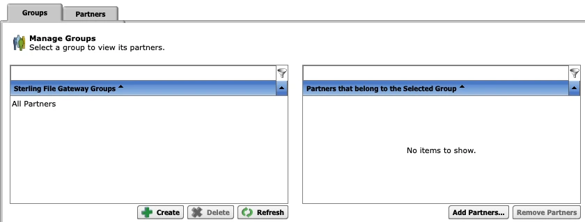
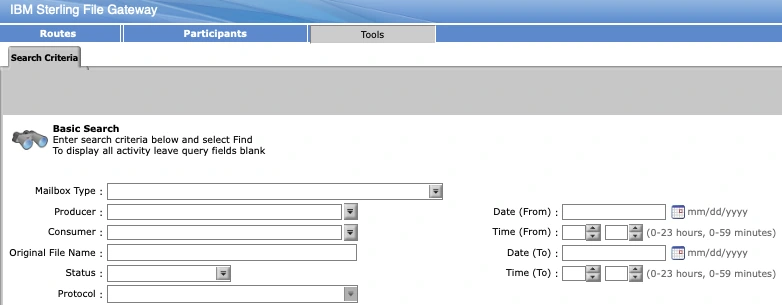

## The confusion I flagged back in Part 1

I called this out in [Part 1](/posts/sterling-b2bi-01-overview/) and promised to come back to it: **File Gateway is not a separate product competing with B2Bi.** It's a purpose-built UI and routing layer sitting directly on top of B2Bi's mailbox and adapter machinery, built specifically so partner file exchange can be managed without anyone touching BPML directly. I still see people who've run Sterling for years talk about the two as if they're alternatives you choose between. They're not — one is the foundation, the other is a way of working with that foundation without writing a Business Process by hand.

One naming note before anything else, because it causes real confusion in job postings, tickets, and casual conversation alike: **File Gateway is almost always referred to as "SFG" — Sterling File Gateway** — its actual product name, distinct from "B2Bi" (Sterling B2B Integrator) even though SFG runs as a component installed on top of a B2Bi environment rather than a standalone system. When someone says "we run SFG," they mean this layer specifically: the Routes/Participants/Tools admin console shown throughout this post, not the core B2Bi admin console from the earlier parts of this series. I'll use "File Gateway" and "SFG" interchangeably from here on, since you'll see both in the wild — IBM's own documentation, partner emails, and job requisitions all mix the two.

This post covers the mailbox foundation first, then what SFG actually adds on top of it.

## What is a Mailbox

A **Mailbox** is a secure, permissioned drop box inside B2Bi — a virtual folder structure that exists as metadata and database records, not literal files sitting in a directory, even though it behaves like one to anything interacting with it over SFTP, HTTP, or the Mailbox APIs. Files land in a mailbox, get picked up from one, and every operation against it is permission-checked and logged the same way any other document movement in the platform is.

Two things about that "virtual" framing matter in practice:

- **Mailbox hierarchy is organizational, not physical.** You build a tree — a root mailbox, shared collection points, per-partner mailboxes underneath — and that structure is what partners and internal processes see when they list or navigate mailboxes. The actual bytes live wherever B2Bi's document storage is configured to put them; the hierarchy you build has nothing to do with that.
- **Permissions are assigned per mailbox, and they're genuinely per-user/per-group**, not just per-adapter. A trading partner's SFTP credentials can be scoped to see exactly one mailbox and nothing else in the tree above or beside it — which is the entire mechanism that lets one shared SFTP Server Adapter safely serve dozens of unrelated partners at once, distinguished by mailbox and credentials rather than a dedicated adapter per partner.

A typical hierarchy looks like this:


flowchart TD
    ROOT["Root Mailbox"]
    ROOT --> DL["Dead Letter Mailbox"]
    ROOT --> EDIIN["EDI Inbound Collection"]
    ROOT --> EDIOUT["EDI Outbound Collection"]
    ROOT --> PARTNERS["Trading Partners"]
    PARTNERS --> PA["Partner A Mailbox"]
    PARTNERS --> PB["Partner B Mailbox"]
    PARTNERS --> PC["Partner C Mailbox"]
    PA --> PAIN["inbound/"]
    PA --> PAOUT["outbound/"]

    style DL fill:#4a1a1a,stroke:#c0392b


The **Dead Letter Mailbox** deserves a callout on its own: it's where files land when they can't be routed anywhere else — a malformed filename, a routing rule with no match, a permission failure mid-process. I check it before I check almost anything else when a partner says "I sent the file but nothing happened," because more often than not, it's sitting right there.

### How a file actually gets into and out of a mailbox

Nothing about mailbox delivery is protocol-specific — the same mailbox can be written to by an SFTP Server Adapter receiving a partner's upload, read from by a Business Process picking up a file to translate, or exposed through File Gateway's own routing, all without the mailbox itself knowing or caring which path is being used:


sequenceDiagram
    participant Partner
    participant AD as SFTP Server Adapter
    participant MB as Mailbox
    participant BP as Business Process
    participant DB as Database

    Partner->>AD: Upload file (SFTP PUT)
    AD->>MB: Deliver to partner's mailbox
    MB->>DB: Record arrival, permissions check
    Note over MB,BP: Mailbox event or scheduled poll triggers pickup
    MB->>BP: File available for processing
    BP->>BP: Route, map, validate
    BP->>MB: Deliver result to destination mailbox
    MB->>DB: Record delivery status


## What File Gateway (SFG) actually is

Strip away the marketing name and SFG is: a routing engine, a partner-management UI, and a set of pre-built Business Processes that IBM ships so you don't have to hand-build the same "receive, validate, route, delivery-confirm" pattern from scratch for every partner relationship. It runs *on* B2Bi — same engine, same adapters, same mailboxes — it just gives you a different, higher-level way to configure partner file exchange, through its own dedicated console organized around three tabs: **Routes**, **Participants**, and **Tools**.

Concretely, SFG adds:

- **Partners and Communities** (the Participants tab) — a structured way to define trading partners and group them into communities, rather than mailbox permissions and trading partner records managed independently of each other. Here's the Groups management screen — note "All Partners" as the default group, with the ability to create additional groups and assign partners into them:

- **Routing Channel Templates** (the Routes tab) — reusable definitions of "when a file matching this pattern arrives from this partner, validate it this way, then deliver it here" — configured through a UI instead of drawn in the Graphical Process Modeler or written as raw BPML.
- **Arrived Files / consumption tracking** (the Tools tab) — a partner-facing (and admin-facing) view of what's shown up, what's been picked up, and what's still pending, without anyone needing to query the document tracking database directly. The search screen under Tools lets you query by mailbox type, producer, consumer, filename, status, protocol, and date/time range:

Running that search against real activity returns a result list like this — each arrived file with its status, producer, original filename, and discovery time:

That same Tools tab also has a **Reports** sub-tab for generating a formatted PDF or similar output across a date range, filtered by producer/consumer group and status (Started, Succeeded, Failed, Ignored) — useful for a recurring partner-facing or internal SLA report rather than one-off lookups:

The routing itself still ultimately moves through mailboxes and still ultimately triggers Business Processes — File Gateway is the layer that generates and manages those for you based on the routing channels you configure:


flowchart LR
    subgraph FG["File Gateway Layer"]
        RC["Routing Channel\nTemplates"]
        PM["Partner &\nCommunity Management"]
        AF["Arrived Files\nTracking"]
    end

    subgraph Core["B2Bi Core (unchanged)"]
        AD["Adapters"]
        MB["Mailboxes"]
        BP["Business Processes"]
    end

    Partner["Trading Partner"] --> AD
    AD --> MB
    RC -.configures.-> BP
    MB <--> BP
    BP --> AF
    PM -.governs.-> RC


That dotted-line relationship is the whole point of this post: **SFG configures and manages the same underlying pieces from Parts 1–4**, it doesn't replace or bypass them. When something breaks in an SFG-managed exchange, you're still debugging an adapter, a mailbox, and a Business Process underneath — the SFG UI is just a friendlier front door to get there, and it even shows you that underlying machinery directly when you drill into a single arrived file's event log:

Read top to bottom, that log *is* the flowchart: the file arrives (`FG_0408`), gets delivered to a mailbox (`FG_0425`), the producer partner is identified (`FG_0404`), route determination runs against the matching Routing Channel Template (`FG_0501`–`FG_0504`), and — in this case — validation against the partner fails (`FG_0455`, in red) before routing can complete. When SFG documentation or a colleague says "check the arrived file events," this is exactly what they mean, and it's usually the fastest way to find out *which* step in the pipeline actually broke instead of guessing.

## When to reach for File Gateway vs. a raw mailbox

**Use File Gateway when:** partner onboarding needs to be repeatable and largely self-service for whoever's doing it, when you want built-in delivery confirmation and a partner-visible arrived-files view without custom-building one, or when the exchange pattern is genuinely "receive from A, validate, deliver to B" without complex conditional branching that the routing channel template can't express cleanly.

**Go straight to a raw mailbox and a hand-built (or existing) Business Process when:** the routing logic is complex enough that a routing channel template becomes more awkward than just writing the BPML directly, when you're integrating with existing Business Processes that already do bespoke validation/mapping that doesn't fit File Gateway's pattern, or for internal-only mailbox usage that was never partner-facing to begin with (an EDI Outbound Collection point being read by a scheduled internal process, for instance).

In practice, most new external partner onboarding at the SFTP-in, deliver-somewhere-out pattern goes through File Gateway now, specifically because the Arrived Files tracking alone saves a meaningful amount of "did they get it" support back-and-forth. Anything with real conditional logic or legacy history still lives as a direct Business Process against mailboxes.

## Operational scenarios

**"The partner says they uploaded, but nothing happened."** Check the Dead Letter Mailbox first — a filename that doesn't match the expected pattern, or a routing channel with no matching rule, sends a file there silently rather than failing loudly. Second stop: the Tools tab's Arrived File search — filtered by that producer and a `Failed` status, it'll usually surface exactly this kind of stuck file in seconds, the same way the two `Failed` results shown earlier did. From there, drilling into the arrived file's event log (as above) tells you *why* — a validation failure, a routing channel with no match, or something further upstream.

**Permission scoping mistakes.** Because mailbox permissions are genuinely fine-grained, it's easy to grant a partner's SFTP credentials broader mailbox visibility than intended — especially on a shared SFTP Server Adapter serving many partners. Worth periodically auditing mailbox permissions against the trading partner list rather than assuming they stayed correctly scoped as the partner list grew.

**Routing channel template changes affecting live traffic.** Editing a routing channel template that's actively in use is not the same as editing a Business Process offline — routing channels can affect in-flight and newly-arriving files immediately. Treat template changes with the same change-control discipline you'd apply to a production BPML edit, not as a casual admin-console tweak.

**Recurring partner SLA reporting.** Rather than manually searching Arrived Files every time a partner asks "how many of our files failed last month," the Reports sub-tab under Tools generates exactly that as a formatted PDF, filtered by producer/consumer group and status — worth setting up as a scheduled habit for high-volume partners rather than reactive one-off lookups.

## Where this fits in the series

This closes the loop from [Part 1's](/posts/sterling-b2bi-01-overview/) component overview: Perimeter Server and Adapters get the file in ([Part 2](/posts/sterling-b2bi-02-adapters-vs-services/)), Business Processes and BPML move and transform it ([Part 3](/posts/sterling-b2bi-03-business-processes-bpml/)), SFTP is the protocol most of those adapters actually speak ([Part 4](/posts/sftp-protocol-fundamentals/)), and Mailboxes — with File Gateway as an optional, higher-level way of managing them — are where the file lands and gets picked up from. Every piece from the Part 1 topology diagram now has its own post behind it.

## Sources & further reading

- [Sterling File Gateway — Overview](https://www.ibm.com/docs/en/b2b-integrator/6.2.0?topic=glance-sterling-file-gateway)
- [Creating a Sterling B2B Integrator Mailbox](https://www.ibm.com/docs/en/b2b-integrator/6.0.2?topic=interoperability-creating-sterling-b2b-integrator-mailbox)
- [Sterling B2B Integrator — Overview](https://www.ibm.com/docs/en/b2b-integrator/6.2.0?topic=glance-sterling-b2b-integrator)

As with the rest of this series: the definitions are IBM's, the framing, the routing diagram, and the operational scenarios are mine.

## What's next

Next up: **The Map Editor** — the translation layer flagged back in [Part 1](/posts/sterling-b2bi-01-overview/), and the source of some of the gnarliest bugs I've chased in production.
