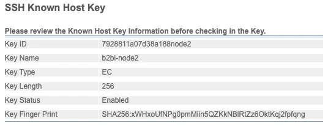

## O aviso que ninguém deveria simplesmente clicar e ignorar

Todo cliente SSH e SFTP tem o mesmo momento assustador: você se conecta a um servidor ao qual já se conectou centenas de vezes, e em vez de um prompt normal, recebe algo assim do OpenSSH:

```text
@@@@@@@@@@@@@@@@@@@@@@@@@@@@@@@@@@@@@@@@@@@@@@@@@@@@@@@@@
@    WARNING: REMOTE HOST IDENTIFICATION HAS CHANGED!     @
@@@@@@@@@@@@@@@@@@@@@@@@@@@@@@@@@@@@@@@@@@@@@@@@@@@@@@@@@
IT IS POSSIBLE THAT SOMEONE IS DOING SOMETHING NASTY!
Someone could be eavesdropping on you right now (man-in-the-middle attack)!
```

Mencionei isso de passagem no [post de SFTP/FTP/FTPS]() como uma das coisas operacionais que costumam confundir, e o assunto merece seu próprio post, porque a resposta honesta e completa para "o que eu faço aqui" é mais do que uma frase — e "simplesmente desabilita a checagem estrita" é a resposta errada com frequência suficiente para valer a pena explicar exatamente por quê.

## O que o known_hosts realmente é

Durante o handshake SSH — o mesmo do [diagrama de sequência do post de SFTP]() — o servidor apresenta uma **host key** para provar sua identidade, da mesma forma que um par de chave privada/pública prova a identidade de um cliente durante a autenticação. O trabalho do cliente é verificar que essa host key realmente pertence ao servidor com quem ele acha que está falando, *antes* de confiar em qualquer outra coisa sobre a conexão, incluindo para onde ele envia sua senha ou quais arquivos ele entrega.

O SSH faz isso com um modelo de confiança no primeiro uso (trust-on-first-use, ou TOFU), não uma cadeia de autoridade certificadora como o TLS normalmente usa. Na primeira vez que você se conecta a um determinado host, o OpenSSH mostra a fingerprint da chave do servidor e pede para você confirmá-la, depois armazena uma entrada — hostname (ou IP), algoritmo de chave e a própria chave — em um arquivo `known_hosts` local (`~/.ssh/known_hosts` por usuário, ou `/etc/ssh/ssh_known_hosts` para todo o sistema). Toda conexão depois dessa compara a chave apresentada com a entrada armazenada automaticamente, sem prompt, a menos que algo não bata.

Isso é genuinamente simples, e é exatamente por isso que o aviso acima é assustador: uma divergência significa que uma de exatamente duas coisas aconteceu, e o cliente não tem como saber qual delas sozinho — ou o servidor legitimamente recebeu uma nova host key, ou algo está interceptando sua conexão e apresentando uma chave completamente diferente. [`ssh(1)`](https://man.openbsd.org/ssh.1) e [`sshd(8)`](https://man.openbsd.org/sshd.8) cobrem esse modelo em detalhe; é em [`ssh_config(5)`](https://man.openbsd.org/ssh_config.5) que esse comportamento é de fato configurado.

### Modos de StrictHostKeyChecking

`StrictHostKeyChecking` no `ssh_config` controla o que acontece em uma primeira conexão e em uma divergência:

- **`yes`** — recusa se conectar a um host desconhecido completamente, e recusa em qualquer divergência. Sem prompts, falha de forma fechada. A configuração certa para qualquer coisa automatizada e sem supervisão.
- **`accept-new`** — o padrão atual do OpenSSH para uso interativo. Aceita e armazena silenciosamente uma chave na *primeira* conexão (ainda TOFU), mas ainda falha de forma fechada em uma divergência contra uma entrada existente.
- **`ask`** — pergunta na primeira conexão (o clássico diálogo "tem certeza que quer continuar se conectando?") e ainda falha de forma fechada em caso de divergência.
- **`no`** — aceita e armazena automaticamente qualquer chave, primeira conexão ou mudada, sem prompts, nunca. Isso desabilita a verificação de host completamente. Aparece constantemente em instruções de "conserto" em fóruns, e anula o propósito inteiro do mecanismo — você aceitaria a chave de um atacante man-in-the-middle tão prontamente quanto a chave real.

Para qualquer coisa voltada a parceiros ou automatizada — o que descreve basicamente toda conexão SFTP do B2Bi — `StrictHostKeyChecking yes` com um arquivo `known_hosts` deliberadamente gerenciado é a postura certa. Jobs sem supervisão nunca deveriam ser os que decidem se confiam em uma chave mudada.

Aqui está toda a decisão de verificação em uma única imagem — isso é o que roda em *toda* conexão SSH ou SFTP, não só nas assustadoras:


flowchart TD
    A["Cliente conecta"] --> B{"Host já está no\nknown_hosts?"}
    B -->|"Não — primeira vez"| C{"Modo do\nStrictHostKeyChecking"}
    C -->|"yes"| D["Recusa a conexão"]
    C -->|"accept-new"| E["Armazena a chave\nsilenciosamente, prossegue"]
    C -->|"ask"| F["Pergunta ao usuário,\ndepois armazena se confirmado"]
    C -->|"no"| G["Armazena a chave\nsilenciosamente, prossegue — sem verificação"]
    B -->|"Sim"| H{"Chave apresentada bate\ncom a entrada armazenada?"}
    H -->|"Bate"| I["Prossegue normalmente —\nsem prompt, sem aviso"]
    H -->|"Não bate"| J["⚠ REMOTE HOST IDENTIFICATION\nHAS CHANGED — falha de forma fechada"]

    style D fill:#4a1a1a,stroke:#c0392b
    style J fill:#4a1a1a,stroke:#c0392b
    style G fill:#4a1a1a,stroke:#c0392b
    style I fill:#1a3a1a,stroke:#27ae60


Aquela caixa vermelha no canto inferior direito é o aviso do topo deste post. Tudo acima dela é o que te levou até ali — e o caminho `no` (canto inferior esquerdo, também vermelho) é o "conserto" de fórum que pula a verificação completamente em vez de realmente resolver algo.

## Fingerprints e algoritmos de host key

Uma fingerprint de host key é um hash curto da chave real, usado porque comparar uma chave completa visualmente é impraticável. O OpenSSH moderno mostra fingerprints como SHA256 codificado em base64 por padrão:

```text
SHA256:xxxxxxxxxxxxxxxxxxxxxxxxxxxxxxxxxxxxxxxxxxx
```

Ferramentas e documentação mais antigas às vezes ainda mostram o formato legado MD5 em hexadecimal separado por dois-pontos — os dois representam a mesma chave por baixo, só com hash exibido de forma diferente; `ssh-keygen -l` pode imprimir qualquer um dos dois (`-E md5` força o formato antigo).

Servidores podem manter múltiplas host keys de tipos diferentes simultaneamente — comumente RSA e ed25519 lado a lado, às vezes ECDSA também — e cliente e servidor negociam qual usar da mesma forma que negociam cifras e MACs, via ordem de preferência de `HostKeyAlgorithms`. Isso importa na prática: se um servidor rotaciona só a host key RSA, mas um cliente está configurado para preferir ed25519, esse cliente pode nem perceber que a chave RSA mudou, porque nunca usa esse tipo de chave. Vale a pena saber a qual tipo de chave os seus jobs automatizados estão de fato fixados antes de assumir que uma rotação foi "silenciosa."

O `ssh-keyscan` busca a(s) chave(s) atualmente apresentada(s) por um host sem passar pelo prompt interativo de TOFU — útil para pré-popular um arquivo `known_hosts` a partir de um processo confiável e automatizado, em vez de um clique interativo de "sim, tenho certeza", e é assim que eu gero as entradas de known_hosts que entrego como parte de um checklist de onboarding de parceiro, em vez de confiar no que um engenheiro clicou uma vez.

### known_hosts com hash

Por padrão, o OpenSSH moderno armazena entradas de `known_hosts` com o próprio hostname com hash (`HashKnownHosts`), especificamente para que um arquivo `known_hosts` vazado não entregue a um atacante uma lista pronta de todo host ao qual você se conecta. Vale a pena saber que isso vem habilitado por padrão e por quê, especialmente em qualquer máquina compartilhada ou multi-tenant — como um Perimeter Server do Sterling terminando conexões de dezenas de trading partners — onde esse arquivo se torna, por si só, uma informação relevante.

## O problema da rotação: mudança legítima vs. algo pior

Aqui está a decisão real que você enfrenta quando aquele aviso aparece, sem a formatação assustadora: **uma chave mudou — era para mudar?**

A única forma confiável de responder isso é verificar a nova fingerprint através de um canal que não seja a própria conexão SSH. Na prática, para conexões de parceiro, isso significa:

1. **Não aceite nada ainda.** A entrada antiga falhando de forma fechada está fazendo o trabalho dela.
2. **Contate o parceiro através de um canal já confiável** — uma ligação para um número conhecido, uma mensagem através de um portal de suporte já estabelecido, uma thread de e-mail assinada com a qual você já tem um relacionamento — e peça para confirmarem a nova fingerprint diretamente. Não "vocês mudaram o servidor SFTP", especificamente a fingerprint SHA256 da nova chave, lida de volta para você ou enviada por esse canal separado.
3. **Compare com o que a conexão está de fato apresentando.** Um `ssh-keyscan` ou uma tentativa manual de conexão vai te mostrar a fingerprint sendo oferecida; ela precisa bater com o que o parceiro confirmou, não só "parecer plausível."
4. **Só então remova a entrada antiga e reconecte.** `ssh-keygen -R hostname` remove a entrada antiga do `known_hosts` de forma limpa (também trata corretamente o caso de hostname com hash, o que editar o arquivo manualmente não faz); reconectar sob `accept-new` ou interativamente então armazena a nova chave já verificada.

Pular direto para `ssh-keygen -R` no momento em que uma conexão falha é o erro mais comum aqui — isso "conserta" o sintoma de forma idêntica, seja a causa uma reconstrução legítima do servidor ou uma interceptação ativa, que é exatamente a distinção que esse mecanismo inteiro existe para preservar.

Como árvore de decisão, os quatro passos acima ficam assim:


flowchart TD
    A["⚠ Aviso de divergência de host key"] --> B["NÃO aceite —\ndeixe a conexão falhar"]
    B --> C["Contate o parceiro por um canal\nout-of-band já confiável"]
    C --> D["Parceiro lê de volta a nova\nfingerprint SHA256 diretamente"]
    D --> E{"Bate com o que a\nconexão está apresentando?"}
    E -->|"Sim"| F["ssh-keygen -R hostname\n— remove a entrada antiga"]
    F --> G["Reconecta — nova chave\narmazenada e confiável"]
    E -->|"Não"| H["PARE — trate como uma\npossível interceptação"]
    H --> I["Investigue o caminho de rede.\nNão se conecte."]

    style A fill:#4a3a1a,stroke:#d4a017
    style H fill:#4a1a1a,stroke:#c0392b
    style I fill:#4a1a1a,stroke:#c0392b
    style G fill:#1a3a1a,stroke:#27ae60


O ponto central do fluxo inteiro é que a etapa de verificação (D → E) acontece em um canal que o atacante em um cenário de MITM não controla. Pule essa etapa e o fluxograma colapsa em "aceita o que quer que a conexão me mostre" — que é só `StrictHostKeyChecking no` com passos extras.

### Escalando isso além da verificação caso a caso

Verificação por telefone não escala além de um punhado de parceiros. Duas abordagens que escalam:

- **Um processo documentado e automatizado de distribuição de `known_hosts`** — popular e atualizar entradas de `known_hosts` a partir de um pipeline controlado (infraestrutura como código, uma execução de gerenciamento de configuração, um manifesto assinado) em vez de prompts interativos individuais, para que "aceitar uma chave nova" seja uma mudança auditável e deliberada, não um clique ad hoc.
- **Certificados SSH** (uma CA assina host keys, e clientes confiam na CA em vez de fixar host keys individuais) resolvem isso corretamente em escala, embora exijam uma infraestrutura de CA e coordenação que a maioria dos relacionamentos com parceiros não vai ter em vigor. As opções de autoridade certificadora do `ssh-keygen` e as opções `TrustedUserCAKeys`/certificado de host do `sshd_config` cobrem a mecânica; vale a pena saber que a opção existe, mesmo que a maioria das configurações de SFTP de parceiro com as quais você vai lidar seja fixação simples de chave via TOFU.

## Dá para manter a mesma host key durante uma atualização do Linux?

Sim — e para qualquer coisa voltada a parceiros, geralmente *deveria*. Uma host key não é nada além de um par de arquivos em disco (tipicamente sob `/etc/ssh/`, uma chave privada como `ssh_host_ecdsa_key` e sua `.pub` correspondente), e o `sshd` apresenta qualquer material de chave que esses arquivos contenham. Nada na chave está atrelado à versão do SO, à versão do pacote, ou ao hardware — desde que os mesmos arquivos de chave existam exatamente nos caminhos que as diretivas `HostKey` do `sshd_config` apontam quando o `sshd` inicia, ele vai apresentar a chave idêntica, com a fingerprint idêntica, e nenhum cliente em lugar nenhum vai ver nada mudar.

Isso significa que o padrão seguro para uma atualização de SO (ou uma migração de servidor, uma reconstrução de container, uma restauração de disaster recovery, qualquer coisa onde a máquina em si muda mas a identidade dela não deveria) é:

1. **Faça backup de `/etc/ssh/ssh_host_*_key` e `ssh_host_*_key.pub`** (todos os tipos de chave que você está servindo atualmente) antes da atualização, preservando dono e permissões — chaves privadas precisam continuar com permissão `600`, de propriedade do `root`.
2. **Rode a atualização.** A maioria dos gerenciadores de pacote vai gerar host keys novas automaticamente se nenhuma existir, que é exatamente o caso que você está evitando.
3. **Restaure os arquivos de chave originais** nos mesmos caminhos, com as mesmas permissões, antes que o `sshd` volte a atender conexões (ou reinicie-o depois de restaurar).
4. **Verifique a fingerprint** com `ssh-keygen -lf /etc/ssh/ssh_host_ecdsa_key.pub` (ou qualquer que seja o tipo) e confirme que bate com a de antes — um seguro barato antes de dar a atualização como concluída.

Faça isso corretamente e a entrada de `known_hosts` de cada parceiro, e cada host key registrada dentro da configuração de trading partner do Sterling, continua válida sem nenhuma coordenação necessária. Pule isso — deixe a atualização gerar chaves novas — e você acabou de fabricar exatamente o cenário de "REMOTE HOST IDENTIFICATION HAS CHANGED" do início deste post, para cada parceiro conectando naquela máquina, em uma agenda auto-infligida. Se você *de fato* acabar rotacionando (deliberadamente, ou porque uma chave nova foi inevitável), esse é o momento de voltar aos passos de verificação acima e tratar isso como qualquer outra rotação planejada: fingerprint comunicada com antecedência, por um canal que você já confia.

## Como isso se parece no B2Bi

A versão do Sterling de um arquivo `known_hosts` é a tela **SSH Known Host Key**, dentro da configuração de trading partner/adapter — é aqui que o B2Bi armazena as host keys que coletou de servidores SFTP remotos antes de confiar neles, seja o servidor de um parceiro (para uma conexão de saída do SFTP Client Adapter) ou outro node no seu próprio cluster.

Coletar uma chave nova passa pela mesma etapa de revisão de fingerprint que o `ssh` faz na primeira conexão, só que com uma UI na frente — aqui ela está puxando a chave do host `192.168.100.251`, mostrando o algoritmo, o tamanho em bits e a fingerprint SHA256 antes de qualquer coisa ser confiada:


Repare na opção **Save To Disk** na parte de baixo, com uma escolha entre **OpenSSH Format** e **SECSH Format** — exatamente os mesmos dois formatos de arquivo de chave cobertos no [post de SFTP/FTP/FTPS](). É exatamente por isso que essa distinção importa na prática: exportar uma host key do Sterling para entregar a um parceiro (ou importar uma que ele te envia) significa escolher o formato que o sistema receptor de fato entende, não só baixar o que quer que seja o padrão.

Depois que uma chave é revisada e registrada, ela aparece como uma entrada gerenciada — ID da chave, nome, tipo, tamanho, status e fingerprint, tudo visível de relance:



Esse `Key Type: EC` / `Key Length: 256` é o rótulo do Sterling para uma chave ECDSA na curva P-256 — o mesmo algoritmo `ecdsa-sha2-nistp256` mostrado na tela de coleta acima, só exposto com nomes de campo mais amigáveis.

Quando a host key de um parceiro muda e a *antiga* é a que está registrada aqui, a conexão de saída simplesmente começa a falhar com um erro de verificação de host key nos logs do Business Process — o mesmo comportamento de falha fechada de um cliente `ssh` encontrando uma divergência de `known_hosts`, só que registrado de forma diferente. Não há ambiguidade no modo de falha, mas isso significa que um parceiro reconstruindo o servidor dele em um fim de semana vira um Business Process travado na segunda-feira de manhã, se ninguém foi avisado com antecedência.

O processo prático que eu sigo: o parceiro nos avisa (ou nós percebemos a falha) → verificamos a nova fingerprint através de um canal out-of-band seguindo os passos acima → coletamos e revisamos a nova chave nessa tela, confirmando que a fingerprint bate com o que foi verificado → registramos ela, substituindo a entrada antiga → re-testamos com uma única transferência manual antes de deixar a agenda automatizada retomar. Vale a pena ter isso escrito em algum lugar que sua equipe consiga achar às 2 da manhã, porque "em qual tela eu atualizo isso mesmo" não é uma pergunta que você quer estar pesquisando durante um incidente.

## Fontes e leituras complementares

- [`ssh(1)`](https://man.openbsd.org/ssh.1)
- [`sshd(8)`](https://man.openbsd.org/sshd.8)
- [`ssh_config(5)`](https://man.openbsd.org/ssh_config.5)
- [`ssh-keygen(1)`](https://man.openbsd.org/ssh-keygen.1)
- [`ssh-keyscan(1)`](https://man.openbsd.org/ssh-keyscan.1)
- [Documentação IBM: Services & Adapters](https://www.ibm.com/docs/en/b2b-integrator/6.2.0?topic=integrator-services-adapters)

Como no resto do que escrevo sobre esse assunto: o conteúdo das páginas de manual é a fonte autoritativa linkada acima, o enquadramento, o processo de rotação e as notas específicas do B2Bi são meus.

Este post é um spin-off de [SFTP, FTP, FTPS: O Protocolo Por Trás dos Adapters]() — vale a pena ler primeiro se você quiser o quadro completo de onde a verificação de host key se encaixa no handshake SSH.
