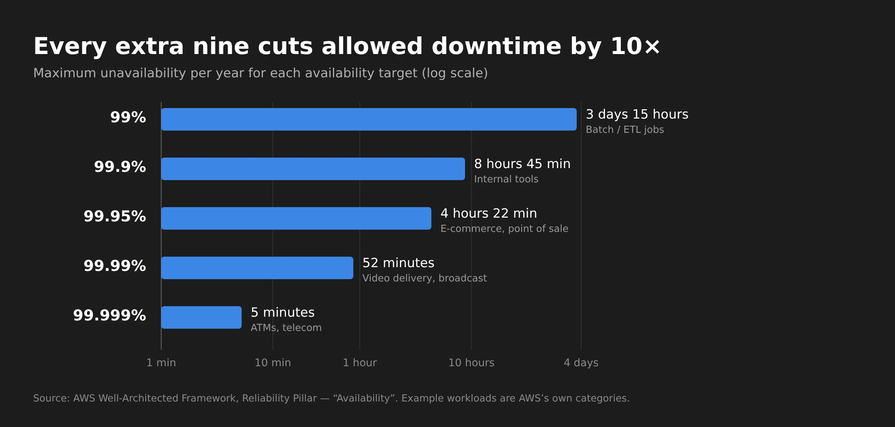

## Moving to the cloud is not the same as being resilient

Picture a classic migration: a handful of VMs running on on-premises VMware are moving to AWS. The work looks straightforward. Rebuild the servers as EC2 instances, set up the VPC, subnets, storage and firewall rules, validate connectivity, and the application is "in the cloud."

Then comes the first architecture meeting, and someone asks:

- What happens if an instance fails?
- What if the database goes offline?
- What if we lose an entire **Availability Zone**?
- How long can we be down?
- How much data can we afford to lose?

None of those questions are about *where* the application runs. They're about **how it behaves when something goes wrong**. That's where two concepts every infrastructure and cloud professional needs to master come in: **High Availability (HA)** and **Disaster Recovery (DR)**.

If you don't work in infrastructure, you may never have thought about them. But you use applications designed around exactly these two ideas every day: your banking app, your streaming service, your email.

## Everything fails, all the time

Every resilient architecture starts by accepting that failure will happen. Werner Vogels, Amazon's CTO, put it plainly in [10 Lessons from 10 Years of AWS](https://www.allthingsdistributed.com/2016/03/10-lessons-from-10-years-of-aws.html):

> *"Failures are a given and everything will eventually fail over time: from routers to hard disks, from operating systems to memory units corrupting TCP packets, from transient errors to permanent failures."*

Disks, CPUs, memory, internet links, a badly tested update, a human mistake. No matter how good the component is, at some point it will fail. The right question isn't *"how do I prevent every failure?"* but *"what happens to my service when one happens?"*

In the cloud there's an important detail. AWS describes it as a [shared responsibility model for resiliency](https://docs.aws.amazon.com/wellarchitected/latest/reliability-pillar/shared-responsibility-model-for-resiliency.html):

- **AWS: resiliency *of* the cloud.** The physical infrastructure, data centers, network and the services they run.
- **You: resiliency *in* the cloud.** How you use those services. A single EC2 instance in a single AZ is still a single point of failure, even when it runs on the most robust infrastructure in the world.


flowchart TB
    subgraph CUSTOMER["You: resiliency IN the cloud"]
        A1["Multi-AZ / Multi-Region architecture"]
        A2["Backups and restore tests"]
        A3["Failover, health checks, Auto Scaling"]
        A4["Defining RTO and RPO"]
    end
    subgraph AWS["AWS: resiliency OF the cloud"]
        B1["Data centers, power, cooling"]
        B2["Global and inter-AZ network"]
        B3["Hardware and virtualization"]
    end
    CUSTOMER --> AWS
    style CUSTOMER fill:#1f2d3d,stroke:#3B87E6,color:#fff
    style AWS fill:#2b2b2b,stroke:#888,color:#fff


Moving a VM from VMware to EC2 takes care of the bottom half of that diagram. The top half is still your job.

## High Availability

**High Availability is an application's ability to keep working when one of its components fails**, keeping availability within the level the business requires.

### Start by finding the SPOFs

Think of a simple application running on a single server:


flowchart LR
    U["👥 Users"] --> S["🖥️ Server A"]
    S --> D[("🗄️ Database")]
    style S fill:#4a1f1f,stroke:#F0564A,color:#fff
    style D fill:#4a1f1f,stroke:#F0564A,color:#fff


Here both **Server A** and the **database** are **Single Points of Failure (SPOFs)**. If either one stops, the application stops. There's no plan B.

The basic tool of High Availability is **redundancy**: more than one copy of every critical component, plus something that knows how to route traffic to the healthy copies.


flowchart LR
    U["👥 Users"] --> LB["⚖️ Load Balancer"]
    LB --> S1["🖥️ Server A"]
    LB --> S2["🖥️ Server B"]
    LB --> S3["🖥️ Server C"]
    S1 & S2 & S3 --> P[("🗄️ Primary DB")]
    P -. replication .-> R[("🗄️ Standby DB")]
    style LB fill:#1f3d2b,stroke:#3FB950,color:#fff
    style P fill:#1f2d3d,stroke:#3B87E6,color:#fff
    style R fill:#1f2d3d,stroke:#3B87E6,color:#fff,stroke-dasharray: 5 5


Now if Server B goes down, the load balancer stops sending traffic to it and the other two carry the load. If the primary database goes down, the standby takes over.

Redundancy costs money, though. The goal isn't to duplicate everything by reflex. It's to **find the SPOFs that actually matter to the business and remove those**, without running short on capacity and without paying for redundancy nobody needs.

### Availability is measured in "nines"

"High" availability is vague. In practice the target is expressed as the percentage of time the service is available: the famous "nines." The [AWS Well-Architected Reliability Pillar](https://docs.aws.amazon.com/wellarchitected/latest/reliability-pillar/availability.html) defines availability as available-for-use time divided by total time, and gives this reference table:

| Availability | Maximum unavailability per year | Example workloads (per AWS) |
|---|---|---|
| 99% | 3 days 15 hours | Batch processing, data extraction and load jobs |
| 99.9% | 8 hours 45 minutes | Internal tools |
| 99.95% | 4 hours 22 minutes | Online commerce, point of sale |
| 99.99% | 52 minutes | Video delivery, broadcast |
| 99.999% | 5 minutes | ATM transactions, telecommunications |

Every extra nine divides the allowed downtime by ten, and usually **multiplies cost and complexity**. That's why the first question in any HA design is: *how many nines does this business actually need?*

### Redundancy at every layer

A highly available architecture thinks about redundancy layer by layer:

| Layer | Risk | How AWS solves it |
|---|---|---|
| Entry point | A single point receives all traffic | [Elastic Load Balancing](https://docs.aws.amazon.com/elasticloadbalancing/latest/userguide/what-is-load-balancing.html), spread across AZs |
| Compute | An instance dies | Multiple instances + [Auto Scaling](https://docs.aws.amazon.com/autoscaling/ec2/userguide/what-is-amazon-ec2-auto-scaling.html) replacing failed ones |
| Database | The primary becomes unavailable | [RDS Multi-AZ](https://docs.aws.amazon.com/AmazonRDS/latest/UserGuide/Concepts.MultiAZSingleStandby.html) with a standby and automatic failover |
| Storage | A volume or object is lost | EBS snapshots, S3 (which already replicates across AZs) |

One database detail that often confuses people: in an RDS Multi-AZ deployment with one standby, AWS [replicates **synchronously**](https://docs.aws.amazon.com/AmazonRDS/latest/UserGuide/Concepts.MultiAZSingleStandby.html) to another AZ, and that standby **can't serve read traffic**. It exists only to take over on failure. To scale reads you use read replicas, which are a different thing.

### Synchronous or asynchronous? It changes how much data you lose

This distinction comes back when we get to RPO:

- **Synchronous replication**: a write is only confirmed once both copies have it. No data loss on failover, but it adds latency. It works well over short distances, like between AZs.
- **Asynchronous replication**: the primary confirms and the replica catches up afterwards. Faster and works over long distances, like between Regions, but the last few writes can be lost if the primary dies.

### Availability Zones vs. Regions: the answer to "what if we lose an AZ?"

On AWS, an [**Availability Zone**](https://docs.aws.amazon.com/whitepapers/latest/aws-fault-isolation-boundaries/availability-zones.html) is one or more data centers with their own separate, redundant power, networking and connectivity. AZs in the same Region are physically separated (up to roughly 100 km / 60 miles) and don't share generators or cooling, but they're close enough for synchronous replication with single-digit-millisecond latency.

A **Region** is a geographic area that contains multiple AZs.

That changes the conversation. A fire, a flood or a power failure that takes down a data center hits **one AZ**. If your application is spread across multiple AZs, that's handled as a **High Availability** event, not a disaster:


flowchart TB
    U["👥 Users"] --> LB["⚖️ Load Balancer (multi-AZ)"]
    subgraph REG["Region us-east-1"]
        subgraph AZA["AZ a"]
            EA["🖥️ EC2"]
            DBP[("🗄️ RDS primary")]
        end
        subgraph AZB["AZ b"]
            EB["🖥️ EC2"]
            DBS[("🗄️ RDS standby")]
        end
        subgraph AZC["AZ c"]
            EC["🖥️ EC2"]
        end
    end
    LB --> EA & EB & EC
    DBP == "synchronous replication" ==> DBS
    style AZA fill:#1b2633,stroke:#3B87E6,color:#fff
    style AZB fill:#1b2633,stroke:#3B87E6,color:#fff
    style AZC fill:#1b2633,stroke:#3B87E6,color:#fff
    style REG fill:#141414,stroke:#666,color:#fff


### How failover actually happens

Redundancy without detection is useless. Something has to notice that a component failed and take it out of the path. In most architectures that's automatic, through **health checks**:


sequenceDiagram
    participant U as User
    participant LB as Load Balancer
    participant A as Server A (AZ a)
    participant B as Server B (AZ b)
    LB->>A: health check
    A--xLB: no response
    LB->>A: health check
    A--xLB: no response
    Note over LB,A: Failure threshold reached → A marked unhealthy
    U->>LB: request
    LB->>B: routes only to healthy targets
    B-->>LB: 200 OK
    LB-->>U: response
    Note over A: Auto Scaling replaces the failed instance


This also shows the difference between two common models:

- **Active-active**: every copy receives traffic at the same time, like the servers behind the load balancer. If one dies, the others are already warm.
- **Active-passive**: one copy works and the other waits, like the RDS standby. Failover takes some time to promote the passive copy.

## Disaster Recovery

**Disaster Recovery is the ability to recover an application, or an entire environment, after a high-impact event**, restoring service as quickly as possible with the smallest acceptable data loss.

### High Availability is not Disaster Recovery

Go back to the redundant architecture above: three servers, two databases, a load balancer. Now imagine **all of it lives in the same place** and that place is lost. It could be a destroyed data center, a whole Region in trouble or, on-premises, the building that caught fire.

Redundancy doesn't help, because every copy went down together.

The [Disaster Recovery of Workloads on AWS](https://docs.aws.amazon.com/whitepapers/latest/disaster-recovery-workloads-on-aws/high-availability-is-not-disaster-recovery.html) whitepaper sums up the difference: *"Availability focuses on components of the workload, whereas disaster recovery focuses on discrete copies of the entire workload."*

HA protects **components**. DR protects **the whole workload**, by keeping a separate copy somewhere else:


flowchart LR
    U["👥 Users"] --> DNS["🌐 DNS / Route 53"]
    DNS ==>|"normal traffic"| P
    DNS -.->|"failover on disaster"| S
    subgraph P["Primary Region"]
        PLB["⚖️ LB"] --> PAPP["🖥️ Multi-AZ app"] --> PDB[("🗄️ DB")]
    end
    subgraph S["Recovery Region"]
        SLB["⚖️ LB"] --> SAPP["🖥️ App (scaled down or off)"] --> SDB[("🗄️ Replica / backups")]
    end
    PDB -. "asynchronous replication + backups" .-> SDB
    style P fill:#1b2633,stroke:#3B87E6,color:#fff
    style S fill:#2b2414,stroke:#E8A33D,color:#fff


### Not every disaster takes down servers

This is the point most people forget. Not every disaster is a fire. Some of the worst ones are **logical**:

- a `DELETE` without a `WHERE` run in production;
- ransomware encrypting your data;
- a buggy release quietly corrupting records for days.

In those cases replication works against you: it copies the mistake to every replica, almost instantly. The same AWS whitepaper is blunt: if files are deleted or corrupted on primary storage, *"those destructive changes can be replicated to the secondary storage device"*, which is why *"a point-in-time backup is also required as part of a DR strategy."*

**Replication protects you from losing infrastructure. Backups protect you from losing data.** A serious DR strategy needs both.

### RTO and RPO: the two numbers that drive everything

Two objectives show up in every DR conversation. The definitions below follow the [AWS whitepaper](https://docs.aws.amazon.com/whitepapers/latest/disaster-recovery-workloads-on-aws/business-continuity-plan-bcp.html):

- **RTO (Recovery Time Objective)**: the maximum acceptable delay between the interruption of service and its restoration. Put simply: *how long can we be down?*
- **RPO (Recovery Point Objective)**: the maximum acceptable amount of time since the last data recovery point. Put simply: *how much data can we lose?*

A concrete example: an **RPO of 15 minutes** means you need a recovery point (backup, snapshot or replication) at least every 15 minutes. An **RTO of 1 hour** means that one hour after the disaster the service must be answering again, with DNS, application and database already running in the recovery environment.

Both numbers are **business decisions**, not technical ones. IT can tell you what each level costs, but the business decides what an hour of downtime is worth.

### The four DR strategies

AWS groups its [disaster recovery options in the cloud](https://docs.aws.amazon.com/whitepapers/latest/disaster-recovery-workloads-on-aws/disaster-recovery-options-in-the-cloud.html) into four strategies, from cheapest and slowest to most expensive and fastest:


flowchart LR
    A["💾 Backup & Restore"] --> B["🔥 Pilot Light"] --> C["🌤️ Warm Standby"] --> D["⚡ Multi-site active/active"]
    A -.- X["Lowest cost Higher RTO/RPO"]
    D -.- Y["Highest cost and complexity RTO/RPO near zero"]
    style A fill:#2b2414,stroke:#E8A33D,color:#fff
    style B fill:#2b2414,stroke:#E8A33D,color:#fff
    style C fill:#1b2633,stroke:#3B87E6,color:#fff
    style D fill:#1b2633,stroke:#3B87E6,color:#fff
    style X fill:none,stroke:none,color:#aaa
    style Y fill:none,stroke:none,color:#aaa


| Strategy | What's ready in the recovery Region | Typical RTO / RPO | Cost |
| --- | --- | --- | --- |
| **Backup & Restore** | Only the backups. Infrastructure is rebuilt on demand, ideally with IaC | Hours | Low |
| **Pilot Light** | Data replicated and the "core" provisioned, but servers switched off | Tens of minutes | Low to medium |
| **Warm Standby** | A complete, working but scaled-down copy that scales up on failover | Minutes | Medium to high |
| **Multi-site active/active** | A full environment serving traffic in every Region | Near zero | High |

*The RTO/RPO ranges are orders of magnitude for comparison, not guarantees. The real numbers depend on how much of the recovery is automated and how often you test it.*

Even with active/active, AWS points out that for data disasters (corruption or deletion) recovery time will be greater than zero and the recovery point will be some time before the problem was discovered. Once again: you still need backups.

To choose, I like to work backwards from the RTO/RPO the business accepts:


flowchart TD
    Q1{"How long can the business afford to be down?"}
    Q1 -->|"Hours"| BR["💾 Backup & Restore"]
    Q1 -->|"Tens of minutes"| PL["🔥 Pilot Light"]
    Q1 -->|"Minutes"| Q2{"Budget to keep a copy running all the time?"}
    Q1 -->|"Practically zero"| AA["⚡ Multi-site active/active"]
    Q2 -->|"Yes, scaled down"| WS["🌤️ Warm Standby"]
    Q2 -->|"No"| PL
    BR & PL & WS & AA --> T["✅ In every case: point-in-time backups + failover tests"]
    style T fill:#1f3d2b,stroke:#3FB950,color:#fff


### A DR plan that's never been tested is just a document

The [Reliability Pillar](https://docs.aws.amazon.com/wellarchitected/latest/reliability-pillar/rel_planning_for_recovery_dr_tested.html) has a best practice dedicated to this (REL13-BP03): regularly test failover to your recovery site and verify that RTO and RPO are met. My favorite line from it: *"the only error recovery that works is the path you test frequently."*

Some tools that help:

- **[AWS Resilience Hub](https://docs.aws.amazon.com/resilience-hub/latest/userguide/what-is.html)**: you define resilience targets (RTO/RPO), it assesses your application against them and recommends improvements based on Well-Architected.
- **[AWS Fault Injection Service (FIS)](https://docs.aws.amazon.com/fis/latest/userguide/what-is.html)**: injects controlled failures (terminate instances, simulate losing an AZ) so you can watch how the application reacts *before* it happens for real.
- **Game days**: planned simulations with the team, stopwatch in hand, to measure the real RTO instead of the spreadsheet RTO.
- **Restore tests**: a backup that has never been restored is a hypothesis, not a backup.

## HA vs. DR, side by side

| | High Availability | Disaster Recovery |
| --- | --- | --- |
| **Question** | How do I keep running when *something* fails? | How do I recover when *everything* fails? |
| **Scope** | Components (instance, disk, database, AZ) | The whole workload (Region, site, data) |
| **Mechanism** | Redundancy + automatic failover | A separate copy of the environment + point-in-time backups |
| **Main metric** | Availability (%, the "nines") | RTO and RPO |
| **On AWS** | Multi-AZ, ELB, Auto Scaling, RDS Multi-AZ | Multi-Region, cross-Region backups, one of the four strategies |
| **Protects against data corruption?** | ❌ No, replication copies the mistake | ✅ Yes, with point-in-time backups |

The two complement each other. An application can be highly available and have no DR at all. And an application with solid DR can still go down every time an instance reboots. The goal is to choose the level of each one on purpose.

## A checklist before migrating any application

If I were starting a cloud migration tomorrow, these are the questions I'd bring to the first meeting, before moving a single VM:

1. **What's the availability target?** How many nines, and who signed off on it?
2. **What are today's SPOFs?** A single server, a database with no replica, a shared NFS mount, a license tied to one host...
3. **Can the application run on multiple instances?** In-memory sessions and files written to local disk are classic blockers for scaling out.
4. **How many AZs?** At least two for critical components.
5. **What are the RTO and RPO for each system?** They're rarely the same for all of them.
6. **Which DR strategy does that RTO/RPO require,** and does the budget cover it?
7. **Are there point-in-time backups in another account or Region,** protected against deletion?
8. **Is the infrastructure defined as code (IaC)?** Rebuilding an environment by hand during a disaster is a recipe for blowing the RTO.
9. **When is the first failover and restore test?** With a date on the calendar.

## Conclusion

High Availability and Disaster Recovery are related, but they solve different problems:

- **High Availability:** how do I keep running when *something* fails?
- **Disaster Recovery:** how do I recover when a failure takes out my *entire* environment?

Moving a VM from VMware to EC2 puts an application in the cloud. What turns a simple migration into a real architecture and resilience discussion is thinking about redundancy, removing SPOFs, spreading components across AZs, defining RTO and RPO, and testing how the environment will come back when something serious happens.

In the end, the question shouldn't just be *"is the application working?"* but also *"what happens when something fails?"*

Because in infrastructure, the question is never **if** something will fail. It's **when**.

## Sources and further reading

### AWS (primary sources for this post)

- [AWS Well-Architected: Reliability Pillar — Availability](https://docs.aws.amazon.com/wellarchitected/latest/reliability-pillar/availability.html): definition of availability and the "nines" table
- [Reliability Pillar — Shared Responsibility Model for Resiliency](https://docs.aws.amazon.com/wellarchitected/latest/reliability-pillar/shared-responsibility-model-for-resiliency.html)
- [Reliability Pillar — REL13-BP03: Test disaster recovery implementation](https://docs.aws.amazon.com/wellarchitected/latest/reliability-pillar/rel_planning_for_recovery_dr_tested.html)
- [Whitepaper: Disaster Recovery of Workloads on AWS](https://docs.aws.amazon.com/whitepapers/latest/disaster-recovery-workloads-on-aws/disaster-recovery-workloads-on-aws.html), especially [Business Continuity Plan (RTO/RPO)](https://docs.aws.amazon.com/whitepapers/latest/disaster-recovery-workloads-on-aws/business-continuity-plan-bcp.html), [High availability is not disaster recovery](https://docs.aws.amazon.com/whitepapers/latest/disaster-recovery-workloads-on-aws/high-availability-is-not-disaster-recovery.html) and [Disaster recovery options in the cloud](https://docs.aws.amazon.com/whitepapers/latest/disaster-recovery-workloads-on-aws/disaster-recovery-options-in-the-cloud.html)
- [Whitepaper: AWS Fault Isolation Boundaries — Availability Zones](https://docs.aws.amazon.com/whitepapers/latest/aws-fault-isolation-boundaries/availability-zones.html)
- [Amazon RDS — Multi-AZ DB instance deployments](https://docs.aws.amazon.com/AmazonRDS/latest/UserGuide/Concepts.MultiAZSingleStandby.html)
- [AWS Resilience Hub](https://docs.aws.amazon.com/resilience-hub/latest/userguide/what-is.html)
- [AWS Fault Injection Service](https://docs.aws.amazon.com/fis/latest/userguide/what-is.html)
- Werner Vogels, [10 Lessons from 10 Years of Amazon Web Services](https://www.allthingsdistributed.com/2016/03/10-lessons-from-10-years-of-aws.html)

### Other perspectives (beyond AWS)

- [IBM — What is high availability?](https://www.ibm.com/think/topics/high-availability)
- [Red Hat — What is high availability?](https://www.redhat.com/en/topics/linux/what-is-high-availability)
- [Google Cloud — What is disaster recovery?](https://cloud.google.com/learn/what-is-disaster-recovery)
- [Microsoft Azure — Business continuity and disaster recovery (Cloud Adoption Framework)](https://learn.microsoft.com/en-us/azure/cloud-adoption-framework/ready/landing-zone/design-area/management-business-continuity-disaster-recovery)

*Definitions, figures and quotes come from the official documentation linked above. The framing, checklist and opinions are mine.*
