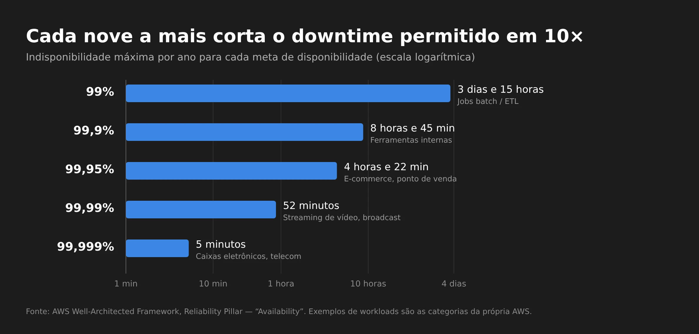

## Colocar na nuvem não é o mesmo que deixar resiliente

Imagine uma migração clássica: algumas VMs rodando em VMware on-premises vão para a AWS. O trabalho parece direto: recriar servidores como instâncias EC2, montar VPC, subnets, storage e regras de firewall, validar a conectividade e pronto, a aplicação está "na nuvem".

Até a primeira reunião de arquitetura, quando alguém pergunta:

- O que acontece se uma instância falhar?
- E se o banco de dados ficar offline?
- E se perdermos uma **Availability Zone** inteira?
- Quanto tempo podemos ficar fora do ar?
- Quanto de dado podemos perder?

Essas perguntas não têm nada a ver com *onde* a aplicação roda. Elas têm a ver com **como ela se comporta quando algo dá errado**. E é aí que entram dois conceitos que todo mundo de infraestrutura e cloud precisa dominar: **Alta Disponibilidade (High Availability, HA)** e **Recuperação de Desastres (Disaster Recovery, DR)**.

Se você não trabalha com infraestrutura, talvez nunca tenha parado para pensar nisso. Mas você usa todos os dias aplicações que foram desenhadas exatamente em cima desses dois conceitos: o app do banco, o streaming, o e-mail.

## Tudo falha, o tempo todo

O ponto de partida de qualquer arquitetura resiliente é aceitar que falhas vão acontecer. Werner Vogels, CTO da Amazon, resumiu isso em [10 lições de 10 anos de AWS](https://www.allthingsdistributed.com/2016/03/10-lessons-from-10-years-of-aws.html):

> *"Failures are a given and everything will eventually fail over time: from routers to hard disks, from operating systems to memory units corrupting TCP packets, from transient errors to permanent failures."*

Disco, CPU, memória, link de internet, uma atualização mal testada, um erro humano. Por melhor que seja o componente, em algum momento ele vai falhar. A pergunta certa não é *"como evito toda falha?"*, mas *"o que acontece com o meu serviço quando ela acontecer?"*.

E na nuvem tem um detalhe importante. A AWS descreve isso como um [modelo de responsabilidade compartilhada para resiliência](https://docs.aws.amazon.com/wellarchitected/latest/reliability-pillar/shared-responsibility-model-for-resiliency.html):

- **AWS: resiliência *da* nuvem.** A infraestrutura física, os datacenters, a rede e os serviços que eles operam.
- **Você: resiliência *na* nuvem.** Como você usa esses serviços. Uma única EC2 em uma única AZ continua sendo um ponto único de falha, mesmo rodando na infraestrutura mais robusta do mundo.


flowchart TB
    subgraph CLIENTE["Você: resiliência NA nuvem"]
        A1["Arquitetura Multi-AZ / Multi-Região"]
        A2["Backups e testes de restore"]
        A3["Failover, health checks, Auto Scaling"]
        A4["Definição de RTO e RPO"]
    end
    subgraph AWS["AWS: resiliência DA nuvem"]
        B1["Datacenters, energia, refrigeração"]
        B2["Rede global e entre AZs"]
        B3["Hardware e virtualização"]
    end
    CLIENTE --> AWS
    style CLIENTE fill:#1f2d3d,stroke:#3B87E6,color:#fff
    style AWS fill:#2b2b2b,stroke:#888,color:#fff


Migrar uma VM do VMware para o EC2 resolve a parte de baixo desse diagrama. A parte de cima continua sendo trabalho seu.

## Alta Disponibilidade (High Availability)

**Alta Disponibilidade é a capacidade de uma aplicação continuar funcionando mesmo quando um dos seus componentes falha**, mantendo a disponibilidade dentro do nível que o negócio exige.

### Comece encontrando os SPOFs

Pense numa aplicação simples rodando em um único servidor:


flowchart LR
    U["👥 Usuários"] --> S["🖥️ Server A"]
    S --> D[("🗄️ Banco de dados")]
    style S fill:#4a1f1f,stroke:#F0564A,color:#fff
    style D fill:#4a1f1f,stroke:#F0564A,color:#fff


Aqui, tanto o **Server A** quanto o **banco de dados** são **Pontos Únicos de Falha (Single Points of Failure, SPOF)**. Se qualquer um deles parar, a aplicação para. Não há plano B.

A ferramenta básica da Alta Disponibilidade é a **redundância**: ter mais de uma cópia de cada componente crítico e algo que saiba direcionar o tráfego para as cópias saudáveis.


flowchart LR
    U["👥 Usuários"] --> LB["⚖️ Load Balancer"]
    LB --> S1["🖥️ Server A"]
    LB --> S2["🖥️ Server B"]
    LB --> S3["🖥️ Server C"]
    S1 & S2 & S3 --> P[("🗄️ DB primário")]
    P -. replicação .-> R[("🗄️ DB standby")]
    style LB fill:#1f3d2b,stroke:#3FB950,color:#fff
    style P fill:#1f2d3d,stroke:#3B87E6,color:#fff
    style R fill:#1f2d3d,stroke:#3B87E6,color:#fff,stroke-dasharray: 5 5


Agora, se o Server B cair, o load balancer para de mandar tráfego para ele e os outros dois seguram a carga. Se o banco primário cair, o standby assume.

Mas redundância tem custo. O objetivo não é duplicar tudo por reflexo, e sim **identificar os SPOFs que realmente importam para o negócio e eliminar esses**, sem faltar capacidade e sem gastar com redundância que ninguém precisa.

### Disponibilidade se mede em "noves"

"Alta" disponibilidade é vago. Na prática, a meta é expressa em porcentagem de tempo em que o serviço está disponível, os famosos "noves". O [Reliability Pillar do AWS Well-Architected](https://docs.aws.amazon.com/wellarchitected/latest/reliability-pillar/availability.html) define disponibilidade como o tempo em que a aplicação está disponível para uso dividido pelo tempo total, e traz esta tabela de referência:

| Disponibilidade | Indisponibilidade máxima por ano | Exemplos de workload (segundo a AWS) |
| --- | --- | --- |
| 99% | 3 dias e 15 horas | Jobs batch, extração e carga de dados |
| 99,9% | 8 horas e 45 minutos | Ferramentas internas |
| 99,95% | 4 horas e 22 minutos | E-commerce, ponto de venda |
| 99,99% | 52 minutos | Distribuição de vídeo, broadcast |
| 99,999% | 5 minutos | Transações de caixa eletrônico, telecom |

Cada nove a mais divide o tempo de indisponibilidade permitido por dez, e normalmente **multiplica o custo e a complexidade**. Por isso, a primeira pergunta de qualquer desenho de HA é: *de quantos noves este negócio realmente precisa?*

### Redundância em cada camada

Uma arquitetura altamente disponível pensa na redundância camada por camada:

| Camada | Risco | Como resolver na AWS |
| --- | --- | --- |
| Entrada | Um único ponto recebe todo o tráfego | [Elastic Load Balancing](https://docs.aws.amazon.com/elasticloadbalancing/latest/userguide/what-is-load-balancing.html), que é distribuído entre AZs |
| Compute | Uma instância cai | Várias instâncias + [Auto Scaling](https://docs.aws.amazon.com/autoscaling/ec2/userguide/what-is-amazon-ec2-auto-scaling.html) recriando as que falham |
| Banco de dados | O banco primário fica indisponível | [RDS Multi-AZ](https://docs.aws.amazon.com/AmazonRDS/latest/UserGuide/Concepts.MultiAZSingleStandby.html) com standby e failover automático |
| Storage | Perda de volume ou objeto | Snapshots de EBS, S3 (que já replica entre AZs) |

Um detalhe sobre o banco que costuma confundir: no RDS Multi-AZ com um standby, a AWS [replica de forma **síncrona**](https://docs.aws.amazon.com/AmazonRDS/latest/UserGuide/Concepts.MultiAZSingleStandby.html) para outra AZ, e esse standby **não serve tráfego de leitura**. Ele existe só para assumir em caso de falha. Para escalar leitura, você usa read replicas, que são outra coisa.

### Síncrono ou assíncrono? Isso muda quanto dado você perde

Essa diferença vai voltar quando falarmos de RPO:

- **Replicação síncrona**: a escrita só é confirmada quando as duas cópias gravaram. Não perde dado no failover, mas adiciona latência. Funciona bem em distâncias curtas, como entre AZs.
- **Replicação assíncrona**: o primário confirma e a réplica recebe depois. É mais rápido e funciona em longas distâncias, como entre regiões, mas as últimas escritas podem se perder se o primário cair.

### Availability Zones vs. Regiões: a resposta para "e se perdermos uma AZ?"

Na AWS, uma [**Availability Zone**](https://docs.aws.amazon.com/whitepapers/latest/aws-fault-isolation-boundaries/availability-zones.html) é um ou mais datacenters com energia, rede e conectividade próprias e redundantes. As AZs de uma mesma região ficam fisicamente separadas (até cerca de 100 km) e não compartilham geradores nem refrigeração, mas estão próximas o suficiente para permitir replicação síncrona com latência de poucos milissegundos.

Uma **Região** é uma área geográfica que contém várias AZs.

Isso muda a conversa. Um incêndio, uma enchente ou uma queda de energia que derruba um datacenter atinge **uma AZ**. Se a sua aplicação está distribuída em várias AZs, isso é tratado como um evento de **Alta Disponibilidade**, e não como um desastre:


flowchart TB
    U["👥 Usuários"] --> LB["⚖️ Load Balancer (multi-AZ)"]
    subgraph REG["Região sa-east-1"]
        subgraph AZA["AZ a"]
            EA["🖥️ EC2"]
            DBP[("🗄️ RDS primário")]
        end
        subgraph AZB["AZ b"]
            EB["🖥️ EC2"]
            DBS[("🗄️ RDS standby")]
        end
        subgraph AZC["AZ c"]
            EC["🖥️ EC2"]
        end
    end
    LB --> EA & EB & EC
    DBP == "replicação síncrona" ==> DBS
    style AZA fill:#1b2633,stroke:#3B87E6,color:#fff
    style AZB fill:#1b2633,stroke:#3B87E6,color:#fff
    style AZC fill:#1b2633,stroke:#3B87E6,color:#fff
    style REG fill:#141414,stroke:#666,color:#fff


### Como o failover acontece na prática

Redundância sem detecção não adianta nada. Alguém precisa perceber que um componente falhou e tirar ele da rota. Na maioria das arquiteturas, isso é automático, por meio de **health checks**:


sequenceDiagram
    participant U as Usuário
    participant LB as Load Balancer
    participant A as Server A (AZ a)
    participant B as Server B (AZ b)
    LB->>A: health check
    A--xLB: sem resposta
    LB->>A: health check
    A--xLB: sem resposta
    Note over LB,A: Limite de falhas atingido → A marcado como unhealthy
    U->>LB: requisição
    LB->>B: encaminha só para alvos saudáveis
    B-->>LB: 200 OK
    LB-->>U: resposta
    Note over A: Auto Scaling substitui a instância com falha


Isso também mostra a diferença entre dois modelos comuns:

- **Ativo-ativo**: todas as cópias recebem tráfego ao mesmo tempo, como os servidores atrás do load balancer. Se uma cai, as outras já estão quentes.
- **Ativo-passivo**: uma cópia trabalha e a outra espera, como o RDS standby. O failover leva um tempo para promover a cópia passiva.

## Disaster Recovery

**Disaster Recovery é a capacidade de recuperar uma aplicação, ou um ambiente inteiro, depois de um evento de grande impacto**, restaurando o serviço o mais rápido possível e com a menor perda de dados aceitável.

### Alta Disponibilidade não é Disaster Recovery

Volte à arquitetura redundante lá de cima: três servidores, dois bancos, load balancer. Agora imagine que **tudo isso está no mesmo lugar** e esse lugar se perde. Pode ser um datacenter destruído, uma região inteira com problema ou, no on-premises, o prédio que pegou fogo.

A redundância não ajuda, porque todas as cópias foram embora juntas.

O whitepaper [Disaster Recovery of Workloads on AWS](https://docs.aws.amazon.com/whitepapers/latest/disaster-recovery-workloads-on-aws/high-availability-is-not-disaster-recovery.html) resume a diferença assim: *"Availability focuses on components of the workload, whereas disaster recovery focuses on discrete copies of the entire workload."*

Ou seja, HA protege **componentes**. DR protege **o workload inteiro**, mantendo uma cópia separada em outro lugar:


flowchart LR
    U["👥 Usuários"] --> DNS["🌐 DNS / Route 53"]
    DNS ==>|"tráfego normal"| P
    DNS -.->|"failover em desastre"| S
    subgraph P["Região primária"]
        PLB["⚖️ LB"] --> PAPP["🖥️ App Multi-AZ"] --> PDB[("🗄️ DB")]
    end
    subgraph S["Região de recuperação"]
        SLB["⚖️ LB"] --> SAPP["🖥️ App (reduzida ou desligada)"] --> SDB[("🗄️ Réplica / backups")]
    end
    PDB -. "replicação assíncrona + backups" .-> SDB
    style P fill:#1b2633,stroke:#3B87E6,color:#fff
    style S fill:#2b2414,stroke:#E8A33D,color:#fff


### Nem todo desastre derruba servidores

Esse é o ponto que mais gente esquece. Nem todo desastre é um incêndio. Alguns dos piores são **lógicos**:

- um `DELETE` sem `WHERE` rodado em produção;
- ransomware criptografando dados;
- uma aplicação com bug corrompendo registros durante dias.

Nesses casos, a replicação é sua inimiga: ela copia o erro para todas as réplicas, quase instantaneamente. O mesmo whitepaper da AWS é direto: se arquivos são apagados ou corrompidos no storage primário, *"those destructive changes can be replicated to the secondary storage device"*, e por isso *"a point-in-time backup is also required as part of a DR strategy."*

**Replicação protege contra perda de infraestrutura. Backup protege contra perda de dados.** Uma estratégia de DR séria precisa das duas coisas.

### RTO e RPO: os dois números que definem tudo

Quando se fala de DR, dois objetivos aparecem em toda conversa. As definições abaixo seguem o [whitepaper da AWS](https://docs.aws.amazon.com/whitepapers/latest/disaster-recovery-workloads-on-aws/business-continuity-plan-bcp.html):

- **RTO (Recovery Time Objective)**: o atraso máximo aceitável entre a interrupção do serviço e a sua restauração. Em outras palavras: *quanto tempo podemos ficar fora do ar?*
- **RPO (Recovery Point Objective)**: o tempo máximo aceitável desde o último ponto de recuperação. Em outras palavras: *quanto de dado podemos perder?*

Um exemplo concreto: **RPO de 15 minutos** significa que você precisa de um ponto de recuperação, seja backup, snapshot ou replicação, pelo menos a cada 15 minutos. **RTO de 1 hora** significa que, uma hora depois do desastre, o serviço precisa estar respondendo de novo, com DNS, aplicação e banco já no ambiente de recuperação.

Os dois números são **decisões de negócio**, não técnicas. TI pode dizer quanto custa cada nível, mas quem define quanto vale uma hora fora do ar é o negócio.

### As quatro estratégias de DR

A AWS organiza as [opções de DR na nuvem](https://docs.aws.amazon.com/whitepapers/latest/disaster-recovery-workloads-on-aws/disaster-recovery-options-in-the-cloud.html) em quatro estratégias, da mais barata e lenta à mais cara e rápida:


flowchart LR
    A["💾 Backup & Restore"] --> B["🔥 Pilot Light"] --> C["🌤️ Warm Standby"] --> D["⚡ Multi-site ativo/ativo"]
    A -.- X["Menor custo RTO/RPO maiores"]
    D -.- Y["Maior custo e complexidade RTO/RPO perto de zero"]
    style A fill:#2b2414,stroke:#E8A33D,color:#fff
    style B fill:#2b2414,stroke:#E8A33D,color:#fff
    style C fill:#1b2633,stroke:#3B87E6,color:#fff
    style D fill:#1b2633,stroke:#3B87E6,color:#fff
    style X fill:none,stroke:none,color:#aaa
    style Y fill:none,stroke:none,color:#aaa


| Estratégia | O que fica pronto na região de recuperação | RTO / RPO típicos | Custo |
| --- | --- | --- | --- |
| **Backup & Restore** | Só os backups. A infraestrutura é recriada na hora, de preferência com IaC | Horas | Baixo |
| **Pilot Light** | Dados replicados e o "núcleo" provisionado, mas com servidores desligados | Dezenas de minutos | Baixo a médio |
| **Warm Standby** | Uma cópia completa e funcional, porém reduzida, que escala no failover | Minutos | Médio a alto |
| **Multi-site ativo/ativo** | Ambiente completo servindo tráfego em todas as regiões | Próximo de zero | Alto |

*As faixas de RTO/RPO são ordens de grandeza para comparação, não garantias. O valor real depende de quanto da recuperação está automatizado e de quanto você testa.*

Mesmo no ativo/ativo, a AWS lembra que, em desastres de dados (corrupção ou deleção), o tempo de recuperação será maior que zero e o ponto de recuperação será anterior ao momento em que o problema foi descoberto. De novo: backup continua necessário.

Para escolher, eu costumo fazer o caminho inverso, partindo do RTO/RPO que o negócio aceita:


flowchart TD
    Q1{"Quanto tempo o negócio aceita ficar fora?"}
    Q1 -->|"Horas"| BR["💾 Backup & Restore"]
    Q1 -->|"Dezenas de minutos"| PL["🔥 Pilot Light"]
    Q1 -->|"Minutos"| Q2{"Orçamento para manter uma cópia rodando?"}
    Q1 -->|"Praticamente zero"| AA["⚡ Multi-site ativo/ativo"]
    Q2 -->|"Sim, em escala reduzida"| WS["🌤️ Warm Standby"]
    Q2 -->|"Não"| PL
    BR & PL & WS & AA --> T["✅ Em todos os casos: backups point-in-time + testes de failover"]
    style T fill:#1f3d2b,stroke:#3FB950,color:#fff


### Um plano de DR que nunca foi testado é só um documento

O [Reliability Pillar](https://docs.aws.amazon.com/wellarchitected/latest/reliability-pillar/rel_planning_for_recovery_dr_tested.html) tem uma boa prática dedicada a isso (REL13-BP03): testar regularmente o failover para o site de recuperação e verificar se o RTO e o RPO são cumpridos. A frase que eu mais gosto de lá é: *"the only error recovery that works is the path you test frequently."*

Algumas ferramentas que ajudam nisso:

- **[AWS Resilience Hub](https://docs.aws.amazon.com/resilience-hub/latest/userguide/what-is.html)**: você define metas de resiliência (RTO/RPO), ele avalia a aplicação contra essas metas e recomenda melhorias baseadas no Well-Architected. A AWS tem um [post em português](https://aws.amazon.com/pt/blogs/aws-brasil/validar-e-melhorar-o-rto-e-o-rpo-usando-o-aws-resilience-hub/) mostrando isso na prática.
- **[AWS Fault Injection Service (FIS)](https://docs.aws.amazon.com/fis/latest/userguide/what-is.html)**: injeta falhas controladas (derrubar instâncias, simular perda de AZ) para você observar como a aplicação reage *antes* de acontecer de verdade.
- **Game days**: simulações planejadas com o time, com cronômetro na mão, para medir o RTO real e não o RTO da planilha.
- **Testes de restore**: backup que nunca foi restaurado é uma hipótese, não um backup.

## HA vs. DR, lado a lado

| | Alta Disponibilidade | Disaster Recovery |
| --- | --- | --- |
| **Pergunta** | Como continuo funcionando quando *algo* falha? | Como me recupero quando *tudo* falha? |
| **Escopo** | Componentes (instância, disco, banco, AZ) | O workload inteiro (região, site, dados) |
| **Mecanismo** | Redundância + failover automático | Cópia separada do ambiente + backups point-in-time |
| **Métrica principal** | Disponibilidade (%, os "noves") | RTO e RPO |
| **Na AWS** | Multi-AZ, ELB, Auto Scaling, RDS Multi-AZ | Multi-Região, backups cross-region, uma das 4 estratégias |
| **Protege contra corrupção de dados?** | ❌ Não, a replicação copia o erro | ✅ Sim, com backups point-in-time |

Os dois se complementam. Uma aplicação pode ser altamente disponível e não ter DR nenhum. E uma aplicação com bom DR pode ficar fora do ar toda vez que uma instância reinicia. O objetivo é decidir conscientemente o nível de cada um.

## Checklist antes de migrar qualquer aplicação

Se eu fosse começar uma migração para a nuvem amanhã, estas são as perguntas que eu levaria para a primeira reunião, antes de mover qualquer VM:

1. **Qual é a meta de disponibilidade?** Quantos noves, e quem assinou embaixo?
2. **Quais são os SPOFs hoje?** Servidor único, banco sem réplica, um NFS compartilhado, uma licença presa a um host...
3. **A aplicação aguenta rodar em várias instâncias?** Sessão em memória local e arquivos gravados em disco local são bloqueios clássicos para escalar horizontalmente.
4. **Quantas AZs?** No mínimo duas para os componentes críticos.
5. **Qual é o RTO e o RPO de cada sistema?** Eles raramente são iguais para todos.
6. **Qual estratégia de DR esse RTO/RPO exige,** e o orçamento cobre?
7. **Existem backups point-in-time, em outra conta ou região,** protegidos contra deleção?
8. **A infraestrutura está em código (IaC)?** Recriar um ambiente na mão durante um desastre é a receita para estourar o RTO.
9. **Quando vai ser o primeiro teste de failover e de restore?** Com data marcada.

## Conclusão

Alta Disponibilidade e Disaster Recovery estão relacionados, mas resolvem problemas diferentes:

- **High Availability:** como continuo funcionando quando *alguma coisa* falha?
- **Disaster Recovery:** como me recupero quando uma falha compromete *todo* o meu ambiente?

Mover uma VM do VMware para o EC2 coloca a aplicação na nuvem. O que transforma uma simples migração em uma discussão de arquitetura e resiliência é pensar em redundância, eliminar SPOFs, distribuir os componentes entre AZs, definir RTO e RPO e testar como o ambiente vai voltar quando algo sério acontecer.

No fim, a pergunta não deveria ser só *"a aplicação está funcionando?"*, mas também *"o que acontece quando alguma coisa falhar?"*.

Porque, em infraestrutura, a questão nunca é **se** algo vai falhar. É **quando**.

## Fontes e leitura adicional

### AWS (fontes primárias deste post)

- [AWS Well-Architected: Reliability Pillar — Availability](https://docs.aws.amazon.com/wellarchitected/latest/reliability-pillar/availability.html): definição de disponibilidade e a tabela dos "noves"
- [Reliability Pillar — Shared Responsibility Model for Resiliency](https://docs.aws.amazon.com/wellarchitected/latest/reliability-pillar/shared-responsibility-model-for-resiliency.html)
- [Reliability Pillar — REL13-BP03: Test disaster recovery implementation](https://docs.aws.amazon.com/wellarchitected/latest/reliability-pillar/rel_planning_for_recovery_dr_tested.html)
- [Whitepaper: Disaster Recovery of Workloads on AWS](https://docs.aws.amazon.com/whitepapers/latest/disaster-recovery-workloads-on-aws/disaster-recovery-workloads-on-aws.html), especialmente [Business Continuity Plan (RTO/RPO)](https://docs.aws.amazon.com/whitepapers/latest/disaster-recovery-workloads-on-aws/business-continuity-plan-bcp.html), [High availability is not disaster recovery](https://docs.aws.amazon.com/whitepapers/latest/disaster-recovery-workloads-on-aws/high-availability-is-not-disaster-recovery.html) e [Disaster recovery options in the cloud](https://docs.aws.amazon.com/whitepapers/latest/disaster-recovery-workloads-on-aws/disaster-recovery-options-in-the-cloud.html)
- [Whitepaper: AWS Fault Isolation Boundaries — Availability Zones](https://docs.aws.amazon.com/whitepapers/latest/aws-fault-isolation-boundaries/availability-zones.html)
- [Amazon RDS — Multi-AZ DB instance deployments](https://docs.aws.amazon.com/AmazonRDS/latest/UserGuide/Concepts.MultiAZSingleStandby.html)
- [AWS Resilience Hub](https://docs.aws.amazon.com/resilience-hub/latest/userguide/what-is.html) e [Validar e melhorar o RTO e o RPO usando o AWS Resilience Hub](https://aws.amazon.com/pt/blogs/aws-brasil/validar-e-melhorar-o-rto-e-o-rpo-usando-o-aws-resilience-hub/) (AWS Brasil)
- [AWS Fault Injection Service](https://docs.aws.amazon.com/fis/latest/userguide/what-is.html)
- Werner Vogels, [10 Lessons from 10 Years of Amazon Web Services](https://www.allthingsdistributed.com/2016/03/10-lessons-from-10-years-of-aws.html)

### Outras visões (fora da AWS)

- [IBM — O que é alta disponibilidade?](https://www.ibm.com/br-pt/think/topics/high-availability)
- [Red Hat — What is high availability?](https://www.redhat.com/en/topics/linux/what-is-high-availability)
- [Google Cloud — What is disaster recovery?](https://cloud.google.com/learn/what-is-disaster-recovery)
- [Microsoft Azure — Business continuity and disaster recovery (Cloud Adoption Framework)](https://learn.microsoft.com/pt-br/azure/cloud-adoption-framework/ready/landing-zone/design-area/management-business-continuity-disaster-recovery)

*As definições, números e citações vêm das documentações oficiais linkadas acima. O enquadramento, o checklist e as opiniões são meus.*
