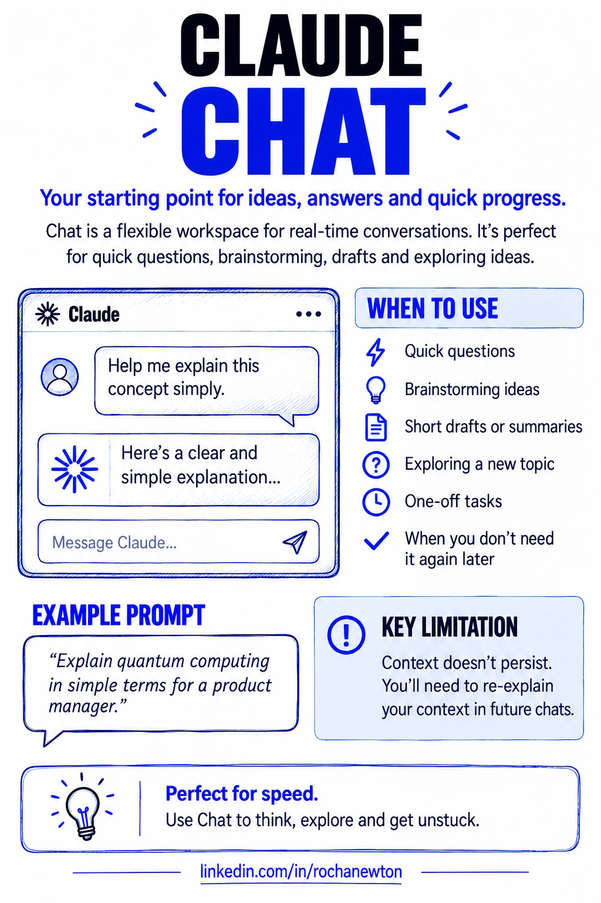

## The chat window is where most people stop

Open Claude, type a question, get an answer, close the tab. Next week, same question-shaped task, same blank chat window, same explaining from zero: who you are, what you're working on, what "good" looks like for this kind of output. If that's the whole relationship, you're using one of the most capable tools available today exactly like you'd use a search box — or, more to the point, exactly like people used ChatGPT in 2020, when a fresh context window every time was just how these things worked.

It isn't anymore, and treating Claude that way costs more than it looks like it does.

## What re-explaining yourself every session actually costs you

None of this shows up as a single dramatic failure. It shows up as friction you've stopped noticing.

You re-upload the same brand guidelines, the same architecture notes, the same "here's how our team writes docs" preamble, every single time, because the last chat didn't carry any of it forward. You get a genuinely useful diagram or draft back, and it lives exactly one scroll-length deep in a chat transcript — findable if you remember which conversation, gone in practice if you don't. You ask a question that actually needs someone to dig across a handful of sources, compare them, and synthesize a real answer, and you get back a confident single-pass response that reads like it did that work but didn't. It looked thorough. It wasn't. And the next person on your team who asks Claude the same thing you already worked through starts over too, because none of what you figured out is anywhere Claude — or they — can find it.

None of that is a Claude limitation. It's a Chat limitation, and Chat is one of [several ways to work with Claude](https://support.claude.com/en/collections/4078531-claude), not the only one.

## Chat: still the right tool for a lot of things

To be clear, Chat isn't the problem — it's the default, and defaults are supposed to handle most cases well. A one-off question, a quick draft, a "help me think through this" conversation that won't need to exist next week: Chat is exactly right for that. The mistake isn't using Chat. It's using *only* Chat for work that's actually ongoing, reusable, or genuinely complex enough to need real investigation.

Here's what I reach for instead, and when.

## Projects: stop re-uploading the same context

A [project](https://support.claude.com/en/articles/9517075-what-are-projects) is a self-contained workspace with its own knowledge base, its own instructions, and its own chat history — separate from your regular Chat. You upload the reference material once (my site's writing conventions, past post drafts, my resume and cert notes), write instructions once ("first-person practitioner voice, cite sources inline, no comparisons between the IBM Sterling and Claude categories"), and every chat inside that project just has it. No re-explaining.

I keep a project for this blog specifically. When I start drafting a new post, Claude already knows the frontmatter format, the tone I want, and the one hard rule about not cross-linking my middleware content with my Claude content — because I said it once, in the project instructions, instead of every single time I open a new chat. That's the whole value: the context compounds instead of resetting.

The practical trigger for "this should be a project, not another chat" is simple — if you can picture asking a variant of the same question again next month, it belongs in a project.

## Artifacts: the output should outlive the conversation

An [artifact](https://support.claude.com/en/articles/9487310-what-are-artifacts-and-how-do-i-use-them) is content substantial enough to get its own dedicated window next to the conversation — a document, a diagram, a working HTML page, a piece of code — instead of a block of text buried in chat that you'll never scroll back to find. Claude creates one automatically once something crosses the line into "significant and self-contained": generally over 15 lines, and something you're actually going to edit, reuse, or reference later rather than just read once.

The distinction that matters here isn't length, it's disposability. A quick explanation belongs in chat. A diagram of your onboarding process, a first draft of a report, a working prototype — those are things with a life after this conversation ends, and burying them in scrollback is how you lose them. I used exactly this for the [4D framework iceberg graphic](/posts/ai-fluency-4d-framework/) in the first post of this series: it needed to exist as its own thing I could pull out, refine, and reuse on LinkedIn — not as a description in the middle of a chat reply.

If you ask for something substantial and Claude just answers in the chat instead, you can say so directly: "create that as an artifact." It's not always automatic, and it's worth the ask.

## Research: when the answer actually requires digging

[Research](https://support.claude.com/en/articles/11088861-use-research-on-claude) is where the "confident single-pass answer that only looks thorough" problem actually gets solved. Turn it on and Claude stops doing one lookup — it plans an approach, runs multiple searches that build on each other, decides what to chase next based on what it already found, and compiles the result into a report with citations you can actually check. It takes minutes instead of seconds, because it's doing minutes of work instead of seconds of work.

That trade-off is the whole point, and it means Research isn't the right call for everything. A quick fact — today's date, a single number, one specific claim — doesn't need it; a single web search answers that faster and Research would just be slower for no benefit. Where it earns its time is comparative or multi-angle work: evaluating a handful of options against the same criteria, pulling together a technical picture from documentation scattered across several sources, or synthesizing what's already been discussed across your own connected tools before adding outside research on top. The test I use: if the honest answer to "how many sources would I need to check to actually trust this?" is more than two or three, that's a Research question, not a Chat question.

## Match the tool to the job

| | Chat | Projects | Artifacts | Research |
|---|---|---|---|---|
| **Persists across sessions?** | No | Yes — knowledge base + instructions | Yes — lives in its own window | No — output can become an artifact |
| **Best for** | One-off questions, quick drafts | Ongoing work with reusable context | Substantial, reusable outputs | Multi-source investigation |
| **Skip it when** | The task is genuinely ongoing | It's a true one-off | The content is short or disposable | One or two sources would settle it |

None of these four replace each other. They stack — a project holding your context, producing an artifact worth keeping, occasionally kicking off a Research pass when a question in that project needs real digging. The 4D Framework from Part 1 of this series is exactly this in miniature: Delegation and Description are you deciding which of these tools the task actually calls for and saying so clearly; Discernment and Diligence are still yours no matter which one you used.

## A diligence statement, since the series keeps making me write one

I collaborated with Claude to research and draft this post, working from Anthropic's own support documentation on Projects, Artifacts, and Research, and from my own experience using each of them for this site. The framing, the examples, and the "match the tool to the job" argument are mine; I checked the feature descriptions against the linked documentation before publishing and stand behind this as an accurate account of how these tools work and how I actually use them.

## Sources & further reading

- [Claude Help Center — get started with Claude](https://support.claude.com/en/collections/4078531-claude)
- [What are projects?](https://support.claude.com/en/articles/9517075-what-are-projects)
- [What are artifacts and how do I use them?](https://support.claude.com/en/articles/9487310-what-are-artifacts-and-how-do-i-use-them)
- [Use research on Claude](https://support.claude.com/en/articles/11088861-use-research-on-claude)

As with the rest of this site: the feature definitions are Anthropic's, the framing and the "you're leaving value on the table" argument are mine.

## Where this fits

This is Part 2 of **Getting Claude Certified**. Part 1 covered the [4D Framework](/posts/ai-fluency-4d-framework/) — the decision-making layer underneath everything. This post is the surface layer: which Claude surface to actually reach for once you've made that decision.