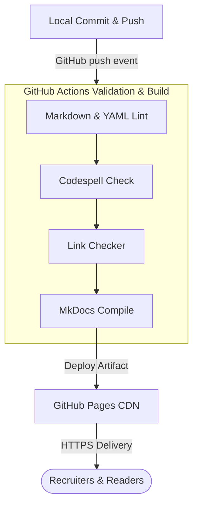

# How to Build and Deploy a Personal Portfolio with MkDocs and GitHub Actions

In the technology industry, your digital footprint is your resume. Whether you are looking for new career opportunities, sharing tutorials, or documenting your cloud learning journey, having a central digital hub is essential. 

However, as a Cloud Architect, when I evaluate how most technologists build and manage their personal websites, I see a common architectural anti-pattern: **over-dependence on third-party platforms or over-engineering local setups.**

In this post, we will explore why you shouldn't rely 100% on platforms like LinkedIn or Medium, perform an architectural evaluation of website hosting scenarios, and walk through a step-by-step guide to build and deploy a version-controlled, 100% free, automated portfolio site using **MkDocs**, **GitHub Actions**, and **GitHub Pages**.

<!-- more -->

---

## 🏛️ The Architectural Dilemma: Renting vs. Owning Your Brand

Most professionals start by building their profiles on LinkedIn, writing posts, and occasionally publishing articles on Medium or Dev.to. While these platforms are excellent for reach, they represent **rented digital space**:

1. **Platform Risk**: You do not own the layout, formatting, or search engine optimization (SEO) of your content. If the platform changes its algorithm or closes down, your digital footprint disappears.
2. **Design Limits**: You cannot inject custom styles (like print layouts, timeline blocks, or interactive tags) to make your resume truly unique.
3. **No Version Control**: You cannot track revisions, write in simple markdown, or collaborate via Pull Requests.

To solve this, we need to treat our personal brand like enterprise cloud infrastructure: it must be **decentralized, owned in plain text, automated, and serverless**.

---

## 📊 The Evaluation Matrix

When designing a personal site, we evaluate options across four pillars: **Cost**, **Ownership**, **Maintenance**, and **Performance**.

| Scenario | Cost | Ownership | Maintenance | Performance / SEO |
| :--- | :--- | :--- | :--- | :--- |
| **LinkedIn / Medium** | Free | 🔴 0% (Platform owned) | Zero | 🟡 Variable (Algorithm dependent) |
| **Custom Next.js / React** | 🟡 Low (Vercel limits) | 🟢 100% (Git owned) | 🟡 Medium (JS dependency hell) | 🟢 Excellent |
| **WordPress / VM Host** | 🔴 Monthly hosting fees | 🟢 100% (DB owned) | 🔴 High (Server patching, DB backups) | 🟡 Slow (Without caching layers) |
| **MkDocs + GitHub Pages** | 🟢 **$0.00 (100% Free)** | 🟢 **100% (Markdown/Git)** | 🟢 **Zero (Static serverless)** | 🟢 **Instant (CDN-delivered)** |

For a resume and technical blog, the **MkDocs + GitHub Pages** stack represents the optimal design: it costs nothing, requires no server maintenance, yields instant page loads via GitHub's global CDN, and keeps all content under git version control.

---

## 🗺️ System Architecture

Every change pushed to your repository is validated, compiled, and deployed automatically:



---

## 🛠️ Step-by-Step Implementation

### Step 1: Initialize the Local Environment
We will use Python to manage the site generator. Create a virtual environment and define your dependencies:

1. Create a `requirements.txt` file containing the core dependencies:
   ```text
   mkdocs==1.6.1
   mkdocs-material==9.7.6
   mkdocs-git-revision-date-localized-plugin==1.5.3
   mkdocs-rss-plugin==1.19.0
   mkdocs-mermaid2-plugin==1.2.3
   pymdown-extensions==10.16
   ```
2. Activate your virtual environment and install the requirements:
   ```bash
   python -m venv .venv
   source .venv/bin/activate  # On Windows: .venv\Scripts\activate
   pip install -r requirements.txt
   ```

### Step 2: Configure the Site (`mkdocs.yml`)
The `mkdocs.yml` file acts as the configuration hub. Here we define our theme (Material), enable features like instant navigation, configure our git repository, and register our plugins:

```yaml
site_name: Your Name
site_description: Cloud, DevOps, and Systems Architecture Portfolio
site_author: Your Name
site_url: https://username.github.io/
repo_url: https://github.com/username/username.github.io
repo_name: username.github.io

theme:
  name: material
  language: en
  palette:
    - scheme: slate
      primary: indigo
      accent: cyan
      toggle:
        icon: material/weather-sunny
        name: Light mode
    - scheme: default
      primary: indigo
      accent: cyan
      toggle:
        icon: material/weather-night
        name: Dark mode
  features:
    - navigation.instant
    - navigation.top
    - navigation.tabs
    - search.suggest
    - content.code.copy

plugins:
  - search
  - tags
  - blog:
      blog_dir: articles
      post_excerpt: required
  - git-revision-date-localized:
      type: timeago
  - rss:
      match_path: articles/.*
      use_git: false
  - mermaid2

markdown_extensions:
  - attr_list
  - md_in_html
  - admonition
  - tables
  - pymdownx.superfences
  - pymdownx.highlight:
      pygments_lang_class: true
  - toc:
      permalink: true
```

### Step 3: Set Up Your Content Directory
Create a `docs/` folder in your root directory. This folder will store all your markdown pages. The default structure should be:
```text
├── docs/
│   ├── index.md        # The homepage (landing page)
│   ├── about.md        # Your professional resume
│   ├── contact.md      # Direct contact channels
│   └── articles/
│       ├── index.md    # Blog feed page
│       └── posts/      # Folder containing individual posts
```

### Step 4: Automate Deployment with GitHub Actions
Create a folder structure named `.github/workflows/` and add a `ci.yml` file. This workflow acts as your CI/CD pipeline, running validation tests and deploying the static site directly:

```yaml
name: Continuous Integration

on:
  push:
    branches:
      - main
  pull_request:
    branches:
      - main

permissions:
  contents: read
  pages: write
  id-token: write

concurrency:
  group: "pages"
  cancel-in-progress: false

jobs:
  validate-build-deploy:
    name: Validate, Build & Deploy
    runs-on: ubuntu-latest

    steps:
      - name: Checkout Code
        uses: actions/checkout@v4

      - name: Markdown Lint
        uses: DavidAnson/markdownlint-cli2-action@v20

      - name: YAML Lint
        uses: ibiqlik/action-yamllint@v3

      - name: Codespell Check
        uses: codespell-project/actions-codespell@v2

      - name: Link Checker
        uses: lycheeverse/lychee-action@v2
        with:
          fail: true

      - name: Setup Python
        uses: actions/setup-python@v5
        with:
          python-version: "3.12"
          cache: "pip"

      - name: Install dependencies
        run: |
          python -m pip install --upgrade pip
          pip install -r requirements.txt

      - name: Build MkDocs
        run: mkdocs build

      - name: Upload Pages Artifact
        if: github.event_name == 'push' && github.ref == 'refs/heads/main'
        uses: actions/upload-pages-artifact@v3
        with:
          path: ./site

      - name: Deploy to GitHub Pages
        id: deployment
        if: github.event_name == 'push' && github.ref == 'refs/heads/main'
        uses: actions/deploy-pages@v4
```

### Step 5: Activate GitHub Actions pages deployment
For the deployment to succeed, you must tell GitHub to allow the workflow to write to your Pages configuration:
1. Navigate to your repository page on GitHub.
2. Click **Settings** > **Pages** (under Code and automation).
3. Under **Build and deployment** > **Source**, click the dropdown and change it from "Deploy from a branch" to **GitHub Actions**.

---

## 🎯 Production Quality Gates (Best Practices)

To ensure your portfolio looks highly professional to recruiters and readers, the CI/CD pipeline enforces several quality gates:
1. **Linter Validation**: Uses `markdownlint` and `yamllint` to ensure there are no syntax bugs or structure errors.
2. **Typo Prevention**: Runs `Codespell` to scan for spelling errors in your text.
3. **Broken Link Checks**: Runs `Lychee` to scan all outbound URLs (excluding LinkedIn and Credly profiles to prevent rate-limit blocks) to guarantee your links remain active.

---

## 🏁 Conclusion

By using this architecture, you gain complete ownership over your digital footprint. You can edit your resume in plain text, push changes via git, and let automation take care of the formatting, testing, and deployment.

It is cost-effective ($0.00 hosting fees), extremely fast, and shows recruiters that you practice exactly what you preach: **sound, automated, serverless cloud architecture.**
